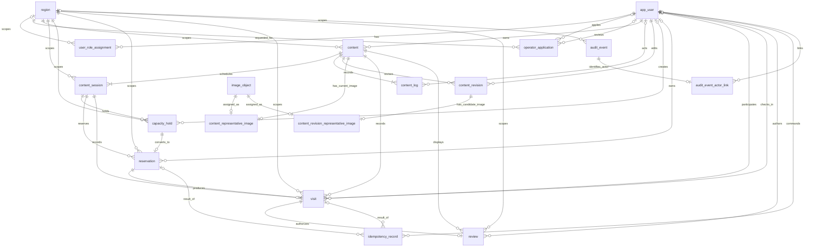
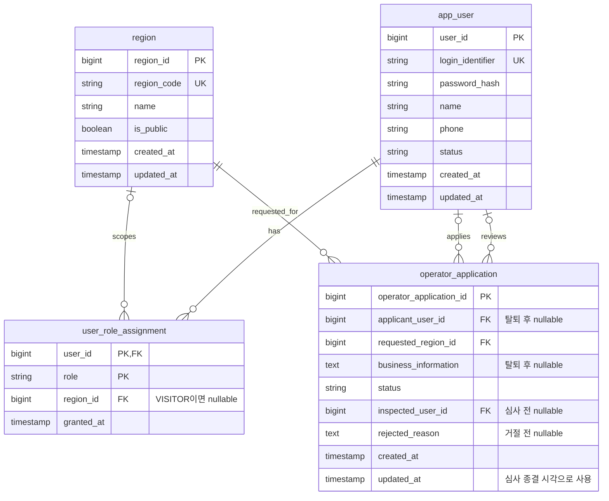
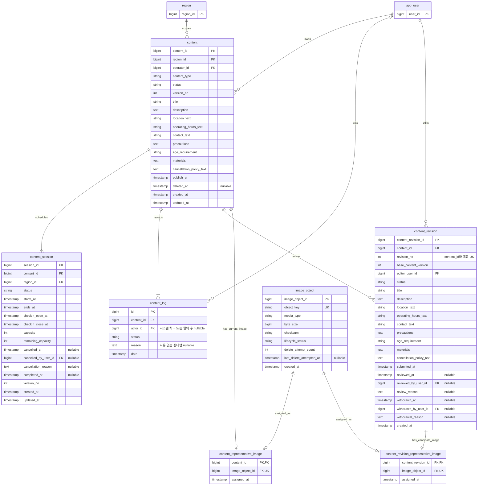
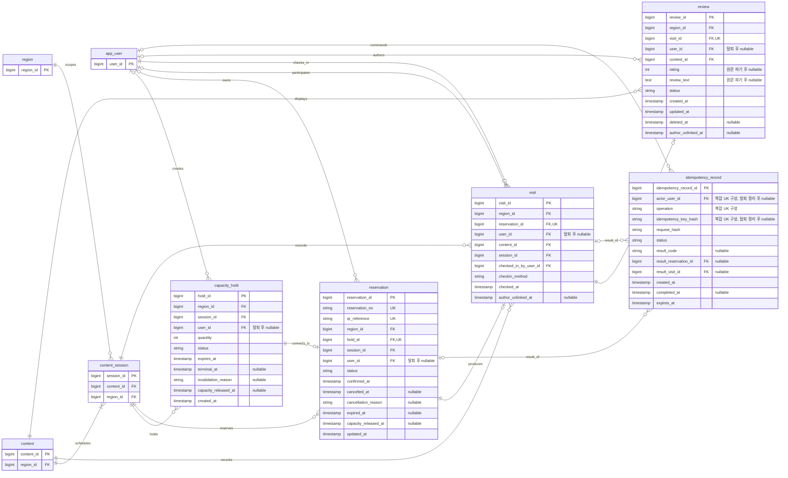
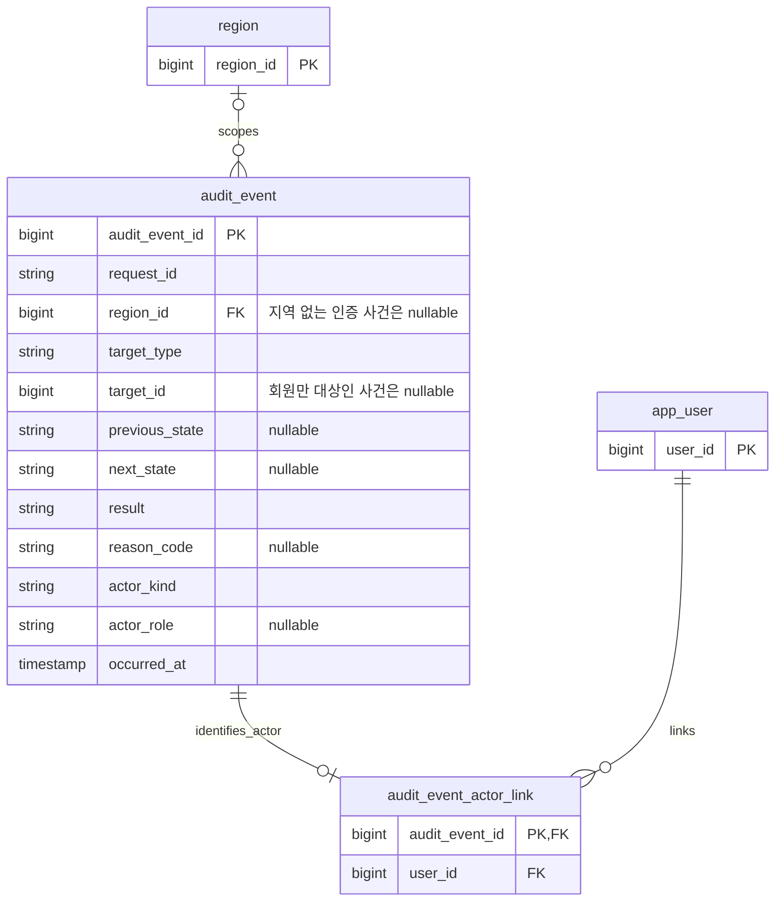

# 로컬스탬프 P0 ERD

## 1. 목적과 범위

이 문서는 김해시·동해시 무료 예약 P0의 MySQL 논리 데이터 모델, 관계, 상태, 제약과 계산식을 정의한다.
구현은 이 문서의 논리 모델을 기준으로 MySQL 8용 Flyway migration을 작성한다. Redis의 Refresh Token
회전·폐기 TTL 키 공간은 관계형 엔티티가 아니므로 이 ERD에 표현하지 않는다.

기준 문서의 우선순위는 다음과 같다.

1. [P0 명세](p0-spec.md)
2. 기능별 P0 소유 문서
   - [인증·프로필](p0/auth-profile.md)
   - [지역·콘텐츠 카탈로그](p0/content-catalog.md)
   - [정원 홀드·무료 예약](p0/reservation.md)
   - [예약 QR·체크인](p0/check-in.md)
   - [인증 후기](p0/review.md)
3. 위 문서가 연결한 채택 ADR

이 문서는 P0 문서에서 확정한 논리 타입과 null 허용 의미를 표현한다.
문자열 길이, 실제 SQL 타입, 인덱스 이름과 FK의 물리적 `ON DELETE` 절은 API 계약과 migration 작성 전에
[미확정 계약](#11-미확정-계약)에서 별도로 확정한다.

### 전체 ER Diagram

아래 그림은 P0의 모든 MySQL 영속 엔티티와 핵심 관계를 컬럼 없이 보여 주는 개요다.
상태 전이 처리자 FK와 `audit_event.target_id`의 논리 대상 참조는 선이 과도하게 겹치므로 생략하고,
각 도메인의 상세 ERD와 제약표에서 정의한다.



### 테이블 역할 요약

이 표는 각 테이블이 보관하는 사실과 사용하는 업무 흐름을 요약한다. 방문자 관련 `user_id`가
`nullable`인 테이블은 생성 시 사용자 연결이 필요하지만, 탈퇴 완료 전에 그 연결을 제거한다.

#### 인증·지역·탈퇴

| 테이블 | 역할 |
| --- | --- |
| `region` | 서비스 지역의 코드·이름·공개 여부를 관리하는 기준 테이블이다. 콘텐츠, 회차, 예약 운영과 지역 권한의 범위를 정한다. |
| `app_user` | 로그인 식별자, 비밀번호 해시, 프로필과 회원 처리 상태를 보관하는 계정의 기준 테이블이다. 탈퇴가 완료되면 행을 남기지 않는다. |
| `user_role_assignment` | 회원에게 부여된 `VISITOR`, `OPERATOR`, `REGION_ADMIN` 역할과 담당 지역을 분리해 관리한다. 한 역할당 담당 지역은 최대 한 곳이다. |
| `operator_application` | 방문자가 운영자 역할과 담당 지역을 신청한 사실, 심사 결과와 사유를 보관한다. 탈퇴 후에는 신청자 연결과 사업자 개인정보를 제거한다. |

#### 콘텐츠·회차·이미지

| 테이블 | 역할 |
| --- | --- |
| `content` | 행사·체험 콘텐츠의 현재 정보, 소유 운영자, 지역, 현재 상태와 공개 전 소프트 삭제 시각을 관리하는 현재 상태 스냅샷이다. P0에서 필요한 연령 조건·준비물·취소 안내도 이 행에 함께 보관한다. |
| `content_session` | 콘텐츠별 예약 가능한 회차의 시간, 체크인 창, 정원과 잔여 정원을 관리한다. 홀드·예약·방문의 기준 단위다. |
| `content_log` | 콘텐츠 생성·상태 변경과 소프트 삭제의 콘텐츠, 처리자, 결과 상태·삭제 코드, 사유와 시각을 보관하는 추가 전용 로그다. 탈퇴 때만 `actor_id`를 제거한다. |
| `content_revision` | 이미 공개된 콘텐츠를 수정하기 위한 모든 후보 필드와 심사 상태를 보관한다. 원본 버전을 기준으로 충돌을 판정하고 승인 시에만 `content`에 반영한다. |
| `image_object` | S3 객체 키, 콘텐츠 타입, 크기, 체크섬과 삭제 재시도 상태를 보관한다. 공개 URL·원본 파일명·사용자 식별자는 저장하지 않는다. |
| `content_representative_image` | 현재 콘텐츠와 대표 이미지 객체를 1:1로 연결한다. 콘텐츠의 현재 노출 이미지를 결정한다. |
| `content_revision_representative_image` | 콘텐츠 수정본과 심사 대상 대표 이미지 객체를 1:1로 연결한다. 승인 전 이미지 후보를 현재 콘텐츠 이미지와 분리한다. |

#### 정원·예약·체크인·후기

| 테이블 | 역할 |
| --- | --- |
| `capacity_hold` | 예약 확정 전 일정 시간 동안 회차 정원을 선점한 사실과 수량, 만료·무효화·정원 복구 상태를 보관한다. 동시 예약 경합을 막는 단위다. |
| `reservation` | 홀드가 확정된 무료 예약의 번호, QR 참조, 회차·지역·예약자 연결과 예약 상태를 관리한다. 홀드 하나는 예약 하나로만 전환된다. |
| `idempotency_record` | 예약 확정과 체크인 명령의 멱등 키, 요청 해시, 처리 상태와 비개인 결과를 보관한다. 성공 시 작업별 결과 FK로 예약 또는 방문 한 건을 연결해 같은 명령의 중복 실행을 막는다. |
| `visit` | 예약이 실제 체크인된 사실, 체크인 방법·시각·처리자와 콘텐츠·회차 연결을 보관한다. 예약 하나당 방문은 최대 하나다. |
| `review` | 체크인 완료 방문에만 작성할 수 있는 인증 후기의 별점·원문·공개/삭제 상태와 원문 파기 시각을 보관한다. 방문 하나당 후기는 최대 하나다. |

#### 감사

| 테이블 | 역할 |
| --- | --- |
| `audit_event` | 지역·콘텐츠·회차·예약 등의 성공·실패 상태 전이와 사유를 90일간 기록한다. 개인정보와 QR 원문은 저장하지 않는다. |
| `audit_event_actor_link` | 활성 회원 actor가 필요한 감사 이벤트에만 사용자 연결을 제공한다. 회원 탈퇴 시 이 연결을 먼저 제거해 감사 본문을 비개인 상태로 유지한다. |

### 표기 규칙

| 표기 | 의미 |
| --- | --- |
| `PK` | 기본 키 |
| `FK` | 외래 키 |
| `UK` | 단일 또는 복합 유일 제약의 구성 컬럼 |
| `nullable` | 정책상 값이 없을 수 있음 |
| `timestamp` | MySQL 기준 시각으로 판정하는 논리 시각 타입 |

- 테이블과 컬럼은 `snake_case`를 사용한다.
- 식별자는 논리 타입 `bigint`로 표현한다. 실제 생성 전략은 migration에서 확정한다.
- 상태와 역할은 논리 타입 `string`으로 표현하고 [상태 카탈로그](#7-상태-카탈로그)의 값만 허용한다.
- 방문자 관련 `user_id`가 `nullable`인 이유는 데이터 생성 시 선택 사항이어서가 아니라,
  회원 탈퇴 완료 전에 직접 사용자 연결을 제거해야 하기 때문이다.
- Mermaid에서 표현하기 어려운 복합 FK, 조건부 유일 제약과 상태 전이 조건은 별도 표로 정의한다.

## 2. 정규화 과정

### 2.1 정규화 전 개념 모델

P0 흐름을 하나의 레코드로 합치면 사용자 역할·지역, 콘텐츠 회차·수정본, 홀드·예약·방문·후기와
상태 이력이 반복된다. 이런 구조는 다음 문제를 만든다.

- 회차나 수정본을 추가할 때 콘텐츠 공통 정보가 중복된다.
- 예약 상태를 바꿀 때 방문·후기 데이터까지 함께 수정해야 한다.
- 운영자 역할 또는 담당 지역 하나를 바꿀 때 사용자 레코드 여러 곳이 불일치할 수 있다.
- 회원 탈퇴 시 후기·방문은 보존하면서 사용자 연결만 제거하기 어렵다.
- 현재 상태와 전체 상태 이력을 한 컬럼 집합으로 동시에 표현할 수 없다.

### 2.2 제1정규형(1NF)

반복 그룹과 다중값을 독립 행으로 분리하고 각 컬럼은 하나의 논리 값만 가진다.

| 정규화 전 반복값 | 1NF 분리 결과 |
| --- | --- |
| 사용자의 역할·담당 지역 목록 | `user_role_assignment` |
| 운영자 신청과 재신청 이력 | `operator_application` |
| 콘텐츠별 회차 목록 | `content_session` |
| 콘텐츠의 상태 변경·소프트 삭제 이력 | `content_log` |
| 공개 콘텐츠 수정 이력 | `content_revision` |
| 상태 전이·실패 이력 | `audit_event` |
| 예약 확정·체크인 재시도 | `idempotency_record` |

표시용 운영 시간, 연령 조건과 준비물은 현재 P0에서 검색·개별 수정 단위를 정의하지 않았으므로 원자적인
표시 문자열로 취급한다. 배열이나 자유 형식 JSON으로 저장하지 않는다. 구조화 요구가 생기면 별도 계약 후
자식 테이블로 분리한다.

### 2.3 제2정규형(2NF)

복합 자연키 일부에만 종속되는 속성을 분리한다.

| 복합 식별 기준 | 분리 원칙 |
| --- | --- |
| `(user_id, role)` | 담당 지역과 부여 시각만 `user_role_assignment`에 둔다. 사용자 프로필은 `app_user`에 둔다. |
| `(content_id, revision_no)` | 수정 후보와 심사 상태만 `content_revision`에 둔다. 현재 공개본은 `content`에 둔다. |
| `(actor_user_id, operation, idempotency_key_hash)` | 요청 해시·처리 상태·결과 참조만 `idempotency_record`에 둔다. |

### 2.4 제3정규형(3NF)

비키 속성 사이의 이행 종속을 제거한다.

- 콘텐츠의 지역명과 운영자 프로필은 `content`에 복사하지 않고 FK로 조회한다.
- 회차의 콘텐츠 제목·위치·운영자 정보는 `content_session`에 복사하지 않는다.
- 예약자 이름·연락처는 홀드·예약에 복사하지 않고 활성 회원 연결로 조회한 뒤 응답 경계에서 마스킹한다.
- 방문과 후기는 예약자 프로필을 복사하지 않고 탈퇴 전까지만 `user_id`로 연결한다.
- 후기 파기 예정 시각은 `deleted_at + 30일`, 수정 마감은 `created_at + 30일`로 계산한다.
- 감사 이벤트 본문에는 사용자 식별자를 넣지 않고 삭제 가능한 `audit_event_actor_link`로 분리한다.
- 콘텐츠 상태 로그의 `actor_id`는 사용자 처리일 때만 기록하며, 회원 탈퇴 완료 전에 `NULL`로 갱신한다.
- P0에서는 콘텐츠 유형이 `EVENT_EXPERIENCE` 하나뿐이므로 연령 조건·준비물·취소 안내도
  `content`의 `content_id`에 완전 함수 종속한다. 별도 1:1 테이블을 만들지 않고 `content`에 함께 둔다.
- 같은 이유로 수정 후보의 연령 조건·준비물·취소 안내도 `content_revision`에 함께 둔다.

### 2.5 통제된 비정규화

다음 컬럼은 순수 3NF에서는 상위 관계나 다른 행으로부터 유도할 수 있지만 P0의 정합성·격리·보존 요구 때문에
의도적으로 저장한다.

| 컬럼 | 저장 이유 | 일관성 조건 |
| --- | --- | --- |
| `content_session.remaining_capacity` | 마지막 좌석 경합을 MySQL 조건부 갱신 한 번으로 판정 | 정원 차감·복구와 홀드/예약 전이를 같은 트랜잭션에서 처리 |
| 하위 집계의 `region_id` | 지역 범위 운영 조회와 권한 누락 방지 | 상위 엔티티의 `region_id`와 복합 FK 또는 동등한 DB 제약으로 일치 |
| `reservation.session_id` | QR·체크인 자격과 회차별 운영 조회의 직접 기준 | 원본 `capacity_hold.session_id`와 복합 FK로 일치 |
| 예약·방문·후기의 직접 `user_id` | 활성 회원의 소유·작성 권한을 검증하고 탈퇴 때 해당 연결만 제거 | 생성 시 상위 사용자 연결과 일치시키고 탈퇴 흐름에서 함께 제거 |
| `visit.content_id`, `visit.session_id` | 탈퇴 후에도 개별 방문의 콘텐츠·회차 사실 보존 | 연결 예약·회차·콘텐츠와 복합 FK로 일치 |
| `review.content_id` | 작성자 연결 제거 후에도 공개 후기의 콘텐츠 연결 유지 | 연결 방문의 `content_id`와 일치 |
| `content.status`, `content.deleted_at` | 일반 조회·자동 공개·소프트 삭제 차단에 필요한 현재 상태 스냅샷 | 상태 변경 또는 소프트 삭제 시 `content_log` 삽입과 같은 트랜잭션에서 갱신 |

이 예외는 편의를 위한 임의 복제가 아니다. 중복 컬럼을 추가할 때는 이 표에 목적과 일관성 제약을 먼저 추가한다.

## 3. 인증·지역 ERD



### 인증·지역 정규화 규칙

- `user_role_assignment`의 PK는 `(user_id, role)`이다. P0에서는 역할별 담당 지역을 최대 한 곳으로 제한한다.
- `role = VISITOR`이면 `region_id IS NULL`, `role IN (OPERATOR, REGION_ADMIN)`이면
  `region_id IS NOT NULL`이어야 한다.
- 운영자 승인 성공 시 `OPERATOR` 역할과 요청 지역 배정을 한 트랜잭션에서 생성한다.
- 지역 관리자 연결은 승인된 배포 초기화로만 생성한다. 일반 API로 `region` 또는
  `REGION_ADMIN` 배정을 생성·변경하지 않는다.
- 운영자 신청은 반려 뒤 재신청할 때 새 행을 생성한다.
- `operator_application`이 `PENDING → APPROVED` 또는 `PENDING → REJECTED`로 종결될 때의
  `updated_at`을 심사 시각으로 사용하며, 별도 `inspected_at` 컬럼은 두지 않는다.
- 신청자 탈퇴 시 `PENDING` 신청은 먼저 `CANCELLED`로 전환하고 모든 신청 상태에서
  `applicant_user_id`와 `business_information`을 제거한다.

## 4. 콘텐츠·회차 ERD



`content_revision.reviewed_by_user_id` 등 반복 처리자 FK 간선은 관계도를 읽기 어렵게 만들므로 Mermaid에서는
생략했다. 이 컬럼들은 `app_user.user_id`를 참조하고 아래 제약을 따른다.

### 콘텐츠·회차 정규화 규칙

- P0의 `content_type`은 `EVENT_EXPERIENCE`만 허용한다. 이 유형에 필요한 연령 조건·준비물·취소 안내는
  `content`의 필수 필드이며 별도 상세 행을 만들지 않는다.
- `content.region_id`와 `content.operator_id`는 서버가 승인된 운영자 권한에서 설정하며 P0에서 변경하지 않는다.
- 콘텐츠 생성 시 `content_log`에 `status = PENDING`, `reason = NULL` 로그를 한 건 추가한다. 이후 상태 변경은 현재
  `content.status`를 전제 상태로 조건부 갱신하고 같은 MySQL 트랜잭션에서 변경 뒤 상태·사유·시각을 로그에 추가한다.
- `content_log.status`는 콘텐츠 상태 카탈로그 값과 소프트 삭제 이벤트 코드 `DELETED`를 기록한다. `DELETED`는
  `content.status` 값이 아니며, 자동 공개·종료 같은 시스템 처리는 `actor_id = NULL`로 기록한다.
- 실제 공개 시각은 `status = PUBLISHED`인 `content_log` 행의 `date`다. `content.publish_at`은 공개 예정 시각이며,
  별도 `content.published_at` 현재 상태 컬럼은 두지 않는다.
- `REJECTED`, `SUSPENDED`, `WITHDRAWN`, `DELETED` 로그는 `reason`이 필수다. 방문자에게 보이는 중단·철회 안내는
  해당 콘텐츠의 최신 `SUSPENDED` 또는 `WITHDRAWN` 로그의 `reason`에서 파생한다.
- 소프트 삭제는 콘텐츠 상태가 아니지만 `PENDING` 또는 `APPROVED`에서 `content.deleted_at`을 설정하고,
  같은 트랜잭션에서 `status = DELETED`와 삭제 사유를 가진 `content_log`, 성공 `audit_event`를 추가한다. 이후 상태 전이는 허용하지 않는다.
- `content_log`의 `content_id`, `status`, `reason`, `date`는 삽입 후 변경하지 않는다. 회원 탈퇴 완료 전 해당 회원의
  `actor_id`만 `NULL`로 갱신하고, 연결이 제거된 로그의 actor 표시는 `WITHDRAWN_MEMBER`로 공통 파생한다.
- 성공한 콘텐츠 상태 변경은 `content` 현재 상태 갱신, `content_log` 추가와 성공 `audit_event` 기록을
  하나의 MySQL 트랜잭션에서 함께 커밋하거나 함께 롤백한다.
- `content_revision`의 논리 유일 키는 `(content_id, revision_no)`다.
- 콘텐츠당 `EDIT_REQUESTED` 수정본은 최대 한 건이다. MySQL에서는 생성 컬럼을 포함한 유일 제약 또는
  동등한 조건부 쓰기 제약으로 강제한다.
- 수정본 승인 조건은 원본 `PUBLISHED`, 수정본 `EDIT_REQUESTED`,
  `content.version_no = content_revision.base_content_version`다.
- 수정본 승인 시 `content_revision`의 모든 후보 필드를 `content`에 반영하고, 원본 버전 증가, 수정본 종결과
  성공 감사 이벤트를 한 트랜잭션에서 처리한다.
- `EDIT_REJECTED`와 `EDIT_WITHDRAWN` 수정본은 원본에 반영하지 않고 보존한다.
- P0 문서가 공개 회차의 수정 가능 필드를 확정하지 않았으므로 `content_session_revision`은 만들지 않는다.
  공개 회차는 `RSV-06`의 명시적 취소 외에 수정본 승인으로 삭제·재배정·정원 변경하지 않는다.
- 현재 ERD는 별도 `DRAFT`가 확정되지 않았으므로 `PENDING`을 심사 제출이 끝난 상태로 해석한다.
  `PENDING` 생성은 필수 콘텐츠 필드·현재 대표 이미지 정확히 한 개와 유효 회차 한 개 이상을
  같은 유스케이스에서 완성해야 한다. 이후 소프트 삭제 전까지 이 최소 관계를 유지한다.
- `content_session.region_id`는 `content.region_id`와 같아야 한다.
- 다음 시각·정원 제약을 적용한다.
  - `starts_at < ends_at`
  - `checkin_open_at < checkin_close_at`
  - `ends_at <= checkin_close_at`
  - `capacity > 0`
  - `0 <= remaining_capacity <= capacity`
- 대표 이미지 관계와 객체 메타데이터를 분리한다. 콘텐츠 또는 수정본은 각각 대표 이미지를 최대 한 개만 가지며,
  하나의 `image_object`는 두 연결 테이블을 통틀어 최대 한 번만 나타난다.
- `image_object.lifecycle_status = ACTIVE`이면 두 대표 이미지 연결 테이블 중 정확히 한 곳에 연결돼야 한다.
  `DELETE_PENDING`이면 모든 연결이 제거돼야 하며 어떤 조회 경로에도 노출하지 않는다.
- 이미지 교체·공개 전 콘텐츠 삭제·수정본 반려 또는 철회로 참조가 사라지면 DB 연결 제거를 먼저 커밋하고
  S3 삭제를 시도한다. 실패하면 같은 `image_object`를 `DELETE_PENDING`으로 유지해 멱등 재시도한다.
- 공개 URL, 원본 파일명과 사용자 식별자는 `image_object`에 저장하지 않는다.

## 5. 홀드·예약·체크인·후기 ERD

아래 상세 ERD는 예약 업무의 읽기 순서를 따라 좌에서 우로 배치한다.
중심 흐름은 `회차 → 홀드 → 예약 → 방문 → 후기`이고, 지역·사용자와 멱등 기록은 각 단계의 보조 관계로
표현한다.



### 홀드·예약 정규화 규칙

- `capacity_hold.quantity`가 확보 인원의 단일 기준이며 항상 `quantity > 0`이어야 한다.
  `reservation`에 같은 인원을 복사하지 않는다.
- `reservation.hold_id`는 유일하며 한 홀드는 예약을 최대 한 건만 만든다.
- 신규 홀드와 예약 확정은 회원이 `ACTIVE`, 콘텐츠가 `PUBLISHED`, 회차가 `SCHEDULED`이고
  DB 현재 시각이 회차 시작 전일 때만 허용한다.
- 홀드 생성 시 `remaining_capacity >= quantity`를 조건으로 회차 정원을 차감하고 `ACTIVE` 홀드를
  같은 트랜잭션에서 생성한다.
- 유효 만료 시각은 `min(created_at + 10분, session.starts_at)`이다. 콘텐츠 비예약 가능 전이,
  회차 취소와 회원 탈퇴는 이 시각보다 먼저 홀드를 `INVALIDATED`로 만들 수 있다.
- `ACTIVE → CONSUMED`와 예약 생성은 한 트랜잭션이며 이때 정원은 변경하지 않는다.
- `ACTIVE → EXPIRED | INVALIDATED`에 성공한 최초 처리만 정원을 복구하고
  `capacity_released_at`을 같은 트랜잭션에서 기록한다.
- 회차 시작 전 `CONFIRMED → CANCELLED`에 성공한 최초 처리만 정원을 복구한다.
  회차 시작 이후 취소, 노쇼와 `CHECKED_IN` 전이는 정원을 복구하지 않는다.
- 노쇼는 `ends_at <= DB 현재 시각`과 `checkin_close_at <= DB 현재 시각`을 모두 만족하는
  `CONFIRMED` 예약만 `EXPIRED`로 전환한다.
- 콘텐츠가 `SUSPENDED | WITHDRAWN | ENDED`로 전환되면 신규 홀드를 차단하고 남은 `ACTIVE` 홀드를
  `INVALIDATED`로 전환해 정원을 한 번 복구한다. 기존 `CONFIRMED | CHECKED_IN` 예약과 방문·후기는
  명시적 회차 취소가 없으면 유지한다.
- 회차가 `CANCELLED`로 전환되면 신규 홀드·예약 확정·QR 발급·새 스캔을 차단하고,
  `ACTIVE` 홀드와 미체크인 `CONFIRMED` 예약만 정책에 따라 종결한다.
- `reservation_no`는 시스템 전체에서 유일한 예약 번호다. QR 실패 시 운영자가 예약 번호만으로
  정확히 한 예약을 보조 조회할 수 있도록 `UNIQUE` 제약을 둔다. 번호 형식은 서버가 생성하며
  이름·연락처·`user_id`를 포함하지 않는다.
- `qr_reference`는 QR에 넣는 불투명 예약 참조다. 이름·연락처·`user_id`를 QR에 넣지 않는다.
- QR은 체크인 창에서 온디맨드로 서명하므로 `qr_token` 테이블을 만들지 않는다.

### 체크인·후기 정규화 규칙

- `visit.reservation_id`는 유일하며 예약당 방문을 최대 한 건으로 제한한다.
- 방문 생성과 `reservation.status = CHECKED_IN` 전이, 성공 감사 이벤트와 멱등 성공 결과 기록을
  한 트랜잭션에서 처리한다.
- `visit.checkin_method`는 `QR` 또는 `RESERVATION_NUMBER`다.
- 예약 번호 보조 조회의 확인 사유·처리자·처리 시각은 `audit_event`에 남긴다.
- `review.visit_id`는 유일하며 방문당 후기를 최대 한 건으로 제한한다.
- 후기 작성 시 활성 사용자 연결이 `visit.user_id`와 같아야 한다.
- `PUBLISHED` 후기의 수정 가능 조건은 `DB 현재 시각 < created_at + 30일`이다.
- 후기 삭제 시 행과 `visit_id` 유일 연결은 보존하고 상태를 `DELETED`로 바꾼다.
  `deleted_at + 30일` 이후 `rating`과 `review_text`만 영구 파기한다.
  이 방식은 삭제 후 복구와 같은 방문의 재작성을 동시에 차단한다.
- 회원 탈퇴는 후기 삭제가 아니다. `PUBLISHED` 상태와 원문을 유지하고 `user_id`를 제거하며
  `author_unlinked_at`을 기록한다. 작성자 표시 문자열은 저장하지 않고 공통 `탈퇴한 사용자`로 파생한다.
- `visit.user_id`, `review.user_id`가 제거돼도 콘텐츠·회차·방문 연결과 집계는 유지한다.

### 멱등 기록 정규화 규칙

- 논리 유일 키는 `(actor_user_id, operation, idempotency_key_hash)`다.
- `operation`은 P0에서 `RESERVATION_CONFIRM`과 `CHECK_IN`만 허용한다.
- 같은 키와 같은 `request_hash`의 완료 요청은 저장된 비개인 결과를 반환한다.
- 같은 키에 다른 `request_hash`가 들어오면 새 명령으로 처리하지 않고 충돌로 거부한다.
- 첫 요청이 처리 중이면 같은 도메인 작업을 다시 실행하지 않는다.
- 멱등 키 점유, 도메인 변경과 성공 결과 기록은 같은 MySQL 트랜잭션에서 처리한다.
- `result_reservation_id`, `result_visit_id`는 작업별 결과 FK다. 각 멱등 기록은 작업에 맞는 결과 FK를
  최대 하나만 가진다.
- `operation = RESERVATION_CONFIRM` 및 `status = SUCCEEDED`이면
  `result_reservation_id`만 존재한다. `operation = CHECK_IN` 및 `status = SUCCEEDED`이면
  `result_visit_id`만 존재한다.
- `PROCESSING`·`FAILED`에는 두 결과 FK가 모두 없다. 저장한 결정적 실패는 `result_code`로 재응답한다.
- P0의 결과 유형은 둘뿐이므로 범용 `result_type`·`result_id` 대신 작업별 결과 FK를
  `idempotency_record`에 직접 둔다.
- 서로 다른 체크인 요청 ID의 유효한 새 QR 재스캔은 기존 `visit` 결과를 반환할 수 있으므로,
  결과 FK에는 유일 제약을 두지 않는다.
- `request_hash`는 개인정보 원문을 포함하지 않는 정규화된 명령 의미로 계산한다.
- 방문자 탈퇴 시 `actor_user_id`, 사용자 기반 키와 역참조 가능한 요청·응답 정보를 제거한다.
  운영 보존이 필요한 비개인 결과만 남긴다.
- 실제 보관 기간과 저장할 실패 종류는 API 명세와 운영 설정에서 확정한다.

## 6. 감사 ERD



### 감사 정규화 규칙

- `audit_event`는 MySQL의 상태 전이 기준 기록이다. 구조화 로그와 외부 전달 이벤트의 대체물이 아니다.
- 이벤트 본문에는 이름·연락처·QR 원문·토큰·`user_id`·사용자별 가명을 저장하지 않는다.
- `target_id`에 `app_user.user_id`를 저장하지 않으며 회원을 직접 식별하는 `target_type`도 허용하지 않는다.
  사용자 관련 사건은 운영자 신청·예약 같은 비개인 도메인 대상을 사용하고, 안전한 대상이 없는 회원 전용
  사건은 `target_id`를 비운다.
- 활성 사용자 식별이 필요할 때만 `audit_event_actor_link`를 둔다.
- 방문자 탈퇴 완료 전에 해당 사용자의 `audit_event_actor_link`를 파기한다.
  연결이 없는 방문자 actor는 모든 탈퇴 회원에 공통인 `WITHDRAWN_MEMBER`로 표시한다.
- `request_id` 자체에는 회원 식별자를 넣지 않으며, 탈퇴 완료 전에 로그·추적 저장소의 회원 상관관계도 제거한다.
- 시스템 자동 공개처럼 사용자 actor가 없는 사건은 `actor_kind = SYSTEM`이고 actor link를 만들지 않는다.
- 성공 상태 전이는 도메인 변경과 감사 이벤트를 같은 트랜잭션에서 커밋한다.
- 롤백된 실패·거부는 롤백 완료 뒤 독립 트랜잭션으로 비개인 실패 이벤트를 기록한다.
- 이벤트 본문은 애플리케이션에서 수정하거나 개별 삭제하지 않는다. 정정은 새 이벤트를 추가한다.
- 보관 기간은 90일이다. `occurred_at + 90일`이 지난 이벤트와 actor link를 보관 작업에서 함께 파기한다.
- Outbox는 P0 범위가 아니므로 `outbox_event` 테이블을 만들지 않는다.

## 7. 상태 카탈로그

| 엔티티 | 허용 값 | 전이 |
| --- | --- | --- |
| `app_user` | `ACTIVE`, `WITHDRAWING` | `ACTIVE → WITHDRAWING`; 완료 후 행 파기 |
| `operator_application` | `PENDING`, `APPROVED`, `REJECTED`, `CANCELLED` | `PENDING → {APPROVED, REJECTED, CANCELLED}` |
| `content` | `PENDING`, `REJECTED`, `APPROVED`, `PUBLISHED`, `SUSPENDED`, `WITHDRAWN`, `ENDED` | `PENDING → {APPROVED, REJECTED}`, `REJECTED → PENDING`, `APPROVED → PUBLISHED`, `PUBLISHED → {SUSPENDED, WITHDRAWN, ENDED}` |
| `content_log.status` | `content` 상태 카탈로그의 값, `DELETED` | 생성·상태 변경 뒤의 `content.status` 또는 소프트 삭제 이벤트를 추가 전용으로 기록 |
| `content_revision` | `EDIT_REQUESTED`, `EDIT_APPROVED`, `EDIT_REJECTED`, `EDIT_WITHDRAWN` | `EDIT_REQUESTED → {EDIT_APPROVED, EDIT_REJECTED, EDIT_WITHDRAWN}` |
| `content_session` | `SCHEDULED`, `COMPLETED`, `CANCELLED` | `SCHEDULED → {COMPLETED, CANCELLED}` |
| `image_object` | `ACTIVE`, `DELETE_PENDING` | 참조 제거 후 `ACTIVE → DELETE_PENDING`; S3 삭제 성공 후 행 파기 |
| `capacity_hold` | `ACTIVE`, `CONSUMED`, `EXPIRED`, `INVALIDATED` | `ACTIVE → {CONSUMED, EXPIRED, INVALIDATED}` |
| `reservation` | `CONFIRMED`, `CHECKED_IN`, `CANCELLED`, `EXPIRED` | `CONFIRMED → {CHECKED_IN, CANCELLED, EXPIRED}` |
| `idempotency_record` | `PROCESSING`, `SUCCEEDED`, `FAILED` | 최초 처리 결과에 따라 `PROCESSING → {SUCCEEDED, FAILED}` |
| `review` | `PUBLISHED`, `DELETED` | `PUBLISHED → DELETED` |
| `audit_event.result` | `SUCCESS`, `FAILURE` | 이벤트 생성 후 변경하지 않음 |

- 같은 결정의 멱등 재요청은 기존 결과를 반환한다.
- 표에 없는 역전이와 종결 상태의 다른 상태 전이는 허용하지 않는다.
- `content`의 `SUSPENDED` 이후 전이는 P0 문서가 확정하지 않았으므로 표에 추가하지 않는다.
- 소프트 삭제는 상태가 아니며 `deleted_at`이 설정된 콘텐츠에는 다른 상태 전이를 허용하지 않는다.

## 8. 핵심 키·참조 무결성

### 유일 제약

| 대상 | 유일 제약 | 목적 |
| --- | --- | --- |
| 지역 | `region(region_code)` | 배포 초기화 재실행 시 중복 방지 |
| 사용자 역할 | `user_role_assignment(user_id, role)` | 역할별 담당 지역 최대 한 곳 |
| 콘텐츠 수정본 | `content_revision(content_id, revision_no)` | 콘텐츠별 순차 수정본 식별 |
| 활성 콘텐츠 수정본 | 콘텐츠별 `EDIT_REQUESTED` 최대 한 건 | 병렬 심사 방지 |
| 원본 대표 이미지 | `content_representative_image(content_id)`, `content_representative_image(image_object_id)` | 콘텐츠별 대표 이미지 최대 한 개, 객체 중복 연결 방지 |
| 수정본 대표 이미지 | `content_revision_representative_image(content_revision_id)`, `content_revision_representative_image(image_object_id)` | 수정본별 대표 이미지 최대 한 개, 객체 중복 연결 방지 |
| 예약 변환 | `reservation(hold_id)` | 한 홀드당 예약 최대 한 건 |
| 예약 번호 | `reservation(reservation_no)` | QR 실패 보조 조회에서 예약 한 건 식별 |
| QR 참조 | `reservation(qr_reference)` | 불투명 QR 참조로 예약 한 건 식별 |
| 방문 | `visit(reservation_id)` | 예약당 방문 최대 한 건 |
| 후기 | `review(visit_id)` | 방문당 후기 최대 한 건 |
| 멱등 요청 | `idempotency_record(actor_user_id, operation, idempotency_key_hash)` | 같은 actor·명령 범위의 재실행 방지 |
| 감사 actor 연결 | `audit_event_actor_link(audit_event_id)` | 이벤트당 활성 actor 연결 최대 한 건 |

### 복합 FK와 동등한 일치 제약

| 하위 엔티티 | 일치해야 하는 상위 관계 |
| --- | --- |
| `content_session` | `(content_id, region_id) = content(content_id, region_id)` |
| `capacity_hold` | `(session_id, region_id) = content_session(session_id, region_id)` |
| `reservation` | `(hold_id, session_id, region_id) = capacity_hold(hold_id, session_id, region_id)` |
| `visit` | `(reservation_id, session_id, region_id) = reservation(reservation_id, session_id, region_id)` |
| `visit` | `(session_id, content_id, region_id) = content_session(session_id, content_id, region_id)` |
| `review` | `(visit_id, content_id, region_id) = visit(visit_id, content_id, region_id)` |

MySQL 복합 FK를 사용하려면 상위 테이블에 대응하는 `UNIQUE` 후보 키를 추가한다.
복합 FK로 표현할 수 없는 다음 불변식은 같은 트랜잭션의 조건부 쓰기와 통합 테스트로 강제한다.

- 콘텐츠 소유자가 해당 지역의 승인된 `OPERATOR`인지
- 신청 심사자가 요청 지역의 `REGION_ADMIN`인지
- 홀드·예약의 활성 `user_id`가 같은지
- 방문 생성 시 `reservation.user_id = visit.user_id`인지
- 후기 작성 시 `visit.user_id = review.user_id`인지
- 같은 이미지 객체가 원본·수정본 대표 이미지 연결 테이블에 동시에 존재하지 않는지
- 멱등 기록의 `operation`, `status`와 작업별 결과 FK 조합이 일치하는지

### 상태별 필수값

| 대상 상태 | 필수값·null 조건                                                                      |
| --- |----------------------------------------------------------------------------------|
| `operator_application.APPROVED` | `inspected_user_id` 존재, `rejected_reason IS NULL`                          |
| `operator_application.REJECTED` | `inspected_user_id`, `rejected_reason` 존재                          |
| `content_log` | `content_id`, `status`, `date` 존재; 상태는 생성·허용된 콘텐츠 상태 전이 뒤의 값 또는 `DELETED`        |
| 시스템 처리 `content_log` | `actor_id IS NULL`                                                               |
| `content_log`의 `REJECTED`, `SUSPENDED`, `WITHDRAWN`, `DELETED` | `reason` 존재                                                                      |
| 소프트 삭제된 `content` | `deleted_at` 존재하고 상태는 `PENDING` 또는 `APPROVED`; 사유를 가진 `DELETED` 로그가 정확히 한 건 존재   |
| `content_revision`의 `EDIT_APPROVED`, `EDIT_REJECTED` | `reviewed_at`, `reviewed_by_user_id`, `review_reason` 존재                         |
| `content_revision.EDIT_WITHDRAWN` | `withdrawn_at`, `withdrawn_by_user_id`, `withdrawal_reason` 존재                   |
| 소프트 삭제 전 모든 `content` | P0 필수 콘텐츠 필드 존재, 현재 대표 이미지 정확히 한 개, `content_session` 한 개 이상 존재                  |
| `content_session.CANCELLED` | `cancelled_at`, `cancelled_by_user_id`, `cancellation_reason` 존재                 |
| `content_session.COMPLETED` | `completed_at` 존재                                                                |
| 모든 `capacity_hold` | `quantity > 0`                                                                   |
| 종결 `capacity_hold` | `terminal_at` 존재; `EXPIRED` 또는 `INVALIDATED`이면 `capacity_released_at`도 존재        |
| `reservation.CANCELLED` | `cancelled_at`, `cancellation_reason` 존재; 회차 시작 전 복구한 경우에만 `capacity_released_at` 존재 |
| `reservation.EXPIRED` | `expired_at` 존재, `capacity_released_at IS NULL`                                  |
| `idempotency_record.SUCCEEDED` | `RESERVATION_CONFIRM`이면 `result_reservation_id`만, `CHECK_IN`이면 `result_visit_id`만 존재 |
| `idempotency_record.PROCESSING`, `FAILED` | `result_reservation_id IS NULL`, `result_visit_id IS NULL`                       |
| `review.PUBLISHED` | `rating`, `review_text` 존재, `deleted_at IS NULL`               |
| `review.DELETED` | `deleted_at` 존재; 파기 전에는 원문 존재, 파기 후에는 원문이 모두 `NULL`            |
| `image_object.ACTIVE` | 대표 이미지 연결이 정확히 하나 존재                                                             |
| `image_object.DELETE_PENDING` | 대표 이미지 연결이 없고 삭제 재시도에서만 조회                                                       |

### 조회 인덱스 후보

다음은 P0 유스케이스가 요구하는 논리 접근 경로다. 실제 컬럼 순서·포함 컬럼·인덱스 이름은 예상 데이터 분포와
`EXPLAIN` 결과를 확인해 Flyway migration에서 확정한다.

| 조회 목적 | 인덱스 후보 |
| --- | --- |
| 역할별 담당 지역 조회 | `user_role_assignment(region_id, role, user_id)` |
| 운영자 신청 심사 대기열 | `operator_application(requested_region_id, status, created_at)` |
| 지역 공개 콘텐츠 목록 | `content(region_id, status, content_type, publish_at, deleted_at)` |
| 자동 공개 대상 | `content(status, publish_at, deleted_at)` |
| 콘텐츠 상태 변경 이력 | `content_log(content_id, date, id)` |
| 콘텐츠 수정본 조회 | `content_revision(content_id, status, created_at)` |
| 회차 목록·운영 상태 | `content_session(content_id, status, starts_at)` |
| 지역 회차 운영 조회 | `content_session(region_id, status, starts_at)` |
| 이미지 삭제 재시도 | `image_object(lifecycle_status, last_delete_attempted_at)` |
| 홀드 만료 작업 | `capacity_hold(status, expires_at)` |
| 탈퇴 대상 활성 홀드 | `capacity_hold(user_id, status)` |
| 사용자 예약 목록 | `reservation(user_id, status, confirmed_at)` |
| 회차 예약자 목록·노쇼 | `reservation(session_id, status)` |
| 예약 번호 보조 조회 | `reservation(reservation_no)` |
| 멱등 기록 정리 | `idempotency_record(status, expires_at)` |
| 방문 운영 조회 | `visit(region_id, content_id, session_id, checked_at)` |
| 공개 후기 목록 | `review(content_id, status, created_at)` |
| 삭제 후기 원문 파기 | `review(status, deleted_at)` |
| 지역 감사 조회 | `audit_event(region_id, occurred_at)` |
| 대상 상태 이력 | `audit_event(target_type, target_id, occurred_at)` |
| 감사 보관 파기 | `audit_event(occurred_at)` |

## 9. 정원·시간 계산과 원자성

### 정원 카운터

`remaining_capacity`는 조회 결과를 매번 합산한 값이 아니라 예약 경합을 직렬화하는 저장 카운터다.

```text
초기값: remaining_capacity = capacity

홀드 생성 성공:
remaining_capacity = remaining_capacity - quantity

홀드 소비:
remaining_capacity 변경 없음

홀드 만료·무효화 최초 성공:
remaining_capacity = remaining_capacity + quantity

회차 시작 전 예약 취소 최초 성공:
remaining_capacity = remaining_capacity + hold.quantity

회차 시작 이후 취소·노쇼·체크인:
remaining_capacity 변경 없음
```

- 모든 갱신은 `0 <= remaining_capacity <= capacity`를 유지한다.
- 홀드 상태 전이와 정원 갱신 중 하나만 커밋되는 상태를 허용하지 않는다.
- 스케줄러는 처리를 촉발할 수 있지만 만료·체크인 창·노쇼 판정은 MySQL 시각과 저장 상태를 기준으로 한다.

### 시간 계산

| 정책 | 계산 |
| --- | --- |
| 홀드 만료 상한 | `min(created_at + 10분, session.starts_at)` |
| 체크인 창 | `checkin_open_at <= DB 현재 시각 < checkin_close_at` |
| QR 만료 상한 | `min(발급 시각 + 운영 설정 TTL, checkin_close_at)` |
| 후기 수정 마감 | `created_at + 30일` |
| 삭제 후기 원문 파기 | `deleted_at + 30일` |
| 감사 이벤트 파기 | `occurred_at + 90일` |

## 10. 탈퇴와 삭제 의미

SQL의 단순 cascade가 아래 업무 순서를 대신해서는 안 된다.

| 대상 | 탈퇴·삭제 처리 |
| --- | --- |
| 방문자 계정 | `ACTIVE → WITHDRAWING` 후 새 명령을 차단하고 모든 연결 제거가 성공하면 계정 행 파기 |
| 역할·자격 증명 | 탈퇴 시작 시 역할을 해제하고 완료 전 자격 증명을 파기 |
| Refresh Token 폐기 상태 | MySQL 커밋 전 Redis에서 활성 계열 전체를 폐기하고 사용자→활성 계열 인덱스를 제거한다. Redis 실패 시 MySQL 탈퇴를 롤백하며, Redis 성공 뒤 MySQL 실패 시 기존 계열은 복구하지 않는다. |
| 운영자 신청 | `PENDING`은 `CANCELLED`; 모든 상태에서 신청자 연결과 사업자 개인정보 제거 |
| 활성 홀드 | `INVALIDATED` 최초 전이와 정원 복구 후 `user_id` 제거 |
| 미체크인 예약 | `CANCELLED`; 회차 시작 전만 정원 복구한 뒤 `user_id` 제거 |
| 방문 | `user_id` 제거, 콘텐츠·회차·체크인 사실과 예약 중복 방지 연결 보존 |
| 후기 | `user_id` 제거; `PUBLISHED` 원문·상태 유지, 기존 `DELETED` 파기 시계 유지 |
| 멱등 기록 | actor·사용자 기반 키·개인 응답 제거, 비개인 결과만 보존 |
| 감사 기록 | `audit_event_actor_link` 제거, 이벤트 본문은 공통 `WITHDRAWN_MEMBER` 의미로 조회 |
| 콘텐츠 | `PENDING`, `APPROVED`만 `deleted_at`을 기록하는 소프트 삭제 |
| 콘텐츠 로그 | 상태·삭제 사유를 추가 전용으로 보관하고, 탈퇴 완료 전 `actor_id`를 `NULL`로 갱신해 actor 표시는 공통 `WITHDRAWN_MEMBER`로 조회 |
| 이미지 | DB 참조 제거 후 S3 즉시 삭제, 실패 시 비공개 `DELETE_PENDING`으로 재시도 |

- 운영 역할 또는 콘텐츠 소유 관계가 남은 계정의 셀프 탈퇴는 P0에서 거부한다.
- 방문자 연결 제거는 명시적 탈퇴 유스케이스가 수행한다. `ON DELETE SET NULL`만으로 도메인 종결 순서를
  대체하지 않는다.
- 계정 파기 직전에는 신청·홀드·예약·방문·후기·멱등·감사·콘텐츠 로그 어디에도 해당 `user_id`가 남지
  않았음을 같은 탈퇴 처리의 완료 조건으로 검사한다.
- 지역, 콘텐츠, 회차, 방문과 후기 사실은 P0 업무 경로에서 연쇄 hard delete하지 않는다.

## 11. 미확정 계약

다음 항목은 현재 P0 문서와 채택 ADR만으로 물리 계약을 하나로 확정할 수 없다.
구현 전에 해당 기준 문서에서 먼저 결정한다.

| 미확정 항목 | 필요한 결정 | 현재 ERD 처리 |
| --- | --- | --- |
| 가입·프로필 필드 | 로그인 식별자 형식, 이름·연락처 validation과 길이 | 논리 필드만 표현 |
| 사업자 정보 | 세부 필드, 암호화·마스킹·보관 방식 | `business_information` 논리 값으로 표현 |
| 역할 중첩 | 한 사용자의 복수 역할 허용·금지 | 역할별 한 행은 허용하되 상호 배타 제약 없음 |
| 콘텐츠 임시 저장 | 별도 `DRAFT` 저장 여부 | 확정 상태에 없는 `DRAFT`를 추가하지 않음 |
| 승인된 `publish_at` 변경 요청 | 요청·심사 상태와 저장 모델 | 별도 엔티티를 추정하지 않음 |
| 전체 콘텐츠 철회 요청 | 승인 전 요청 상태·반려·재시도 모델 | 승인 후 현재 상태와 감사만 표현 |
| 콘텐츠 `REJECTED` 삭제 | 삭제 허용 여부 | 허용 상태에 임의 포함하지 않음 |
| `SUSPENDED` 후속 전이 | 재개·종료·철회 가능 여부 | 후속 전이를 추가하지 않음 |
| 콘텐츠 종료 판정 기준 | 별도 종료 예정일, 마지막 회차 종료 또는 정상 종료의 구체 조건 | `content_log.status = ENDED`의 `date`만 기록하고 별도 `ended_at` 컬럼은 두지 않음 |
| 공개 회차 수정 | 수정 가능한 일정·정원 필드 | 회차 리비전 테이블 제외 |
| 별점·후기 validation | 별점 범위, 텍스트 길이·빈 값 허용 | 논리 타입만 표현 |
| QR 운영 설정 | 토큰 TTL, 키 회전 유예 | 비영속 설정으로 유지 |
| 멱등 운영 설정 | 보관 기간, 저장할 실패 종류·결과 코드 | 논리 필드만 표현 |
| 물리 스키마 | SQL 타입·길이·기본값·인덱스명·FK 삭제 절 | Flyway 작성 전 확정 |

이 표의 항목을 임의 구현하지 않는다. 되돌리기 어렵거나 여러 도메인에 영향을 주는 선택은 ADR로 먼저 확정하고,
API 요청·응답에 영향을 주는 항목은 [API 명세서](api-specification.md)를 함께 갱신한다.

## 12. P0 제외 범위

다음 테이블은 현재 ERD에 포함하지 않는다.

- 결제·환불·결제 웹훅
- 쿠폰·스탬프북·포인트·미션
- 후기 신고·운영자 답글
- 전체 관리자와 전역 권한
- Transactional Outbox와 외부 알림·분석 전달
- 영속 QR 토큰
- Redis 캐시·요청 제한·Refresh Token 회전·폐기 TTL 키 공간·분산 락
- 행사·체험 외 콘텐츠 유형과 그 상세 필드
- 사용자별 탈퇴 tombstone·안정 가명·재식별 매핑
