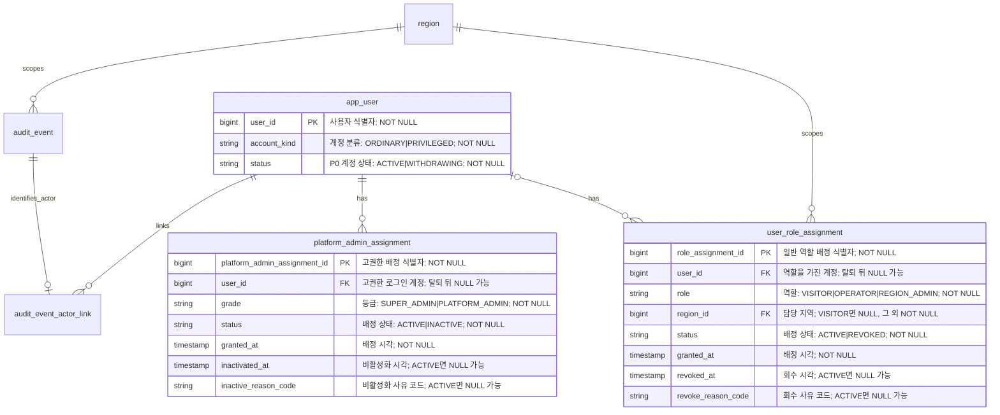
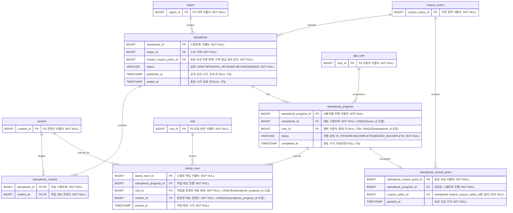
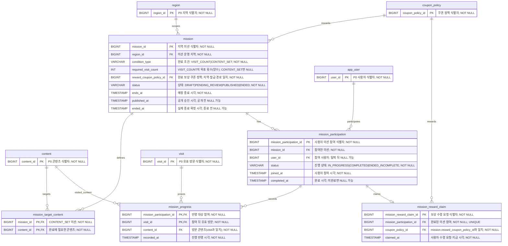
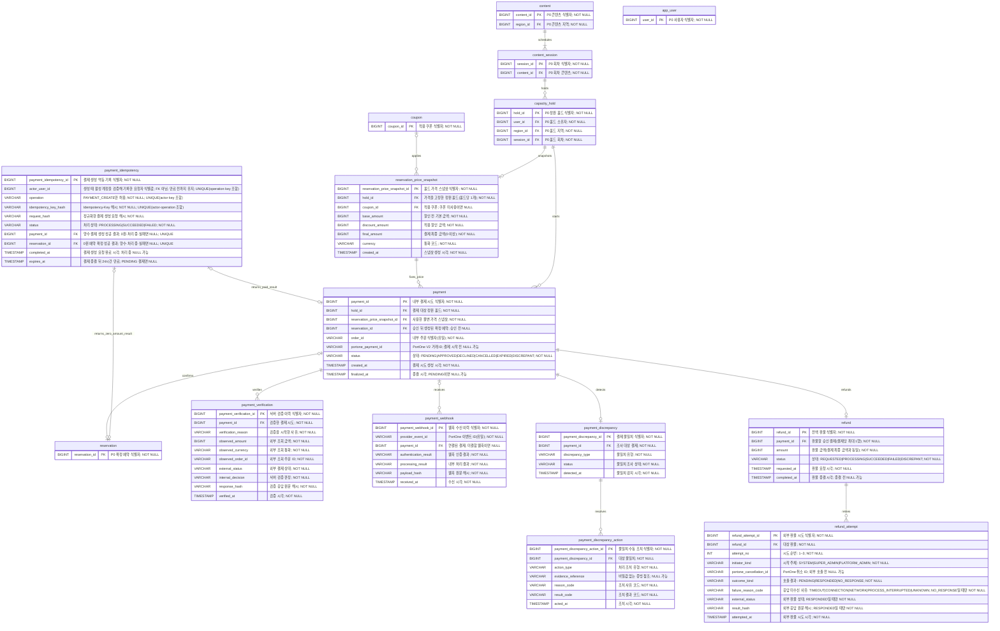

# 로컬스탬프 P1 ERD 초안

> 상태: 정책 반영 초안
> 작성일: 2026-08-05
> 근거: [P1 정책 결정 로그](p1-policy-decision-log.md), P1 도메인별 정책 문서와 각 문서가 연결한 채택 핵심 ADR
> 범위: P0 ERD를 대체하지 않는다. P1에서 추가·변경되는 논리 테이블, 제약, 상태 전이와 P0 재사용 경계만 정의한다.

## 1. 기준과 범위

이 초안은 다음 프로젝트 문서를 기준으로 한다.

- `docs/erd.md`의 P0 기준 테이블과 개인정보 경계
- `docs/p1/stampbook.md`, `docs/p1/regional-mission.md`, `docs/p1/coupon.md`
- `docs/p1/payment-refund.md`, `docs/p1/platform-admin.md`
- `docs/adr/0012-retain-author-unlinked-reviews-and-visits-after-withdrawal.md`
- 각 P1 정책 문서가 연결한 핵심 ADR. 지역 결정의 핵심·세부·보정 기록 분류는 `docs/p1/platform-admin.md`를 따른다.

P1은 다음 P0 사실을 변경하지 않고 재사용한다.

| P0 요소 | P1에서의 사용 |
| --- | --- |
| `visit` | 스탬프·미션·방문 보상 쿠폰의 변경 불가능한 원본 근거 |
| `capacity_hold` | 유료 결제 중에도 최대 10분 동안 정원을 선점하는 유일한 단위 |
| `reservation` | 서버 검증 승인 또는 0원 예약 확정 뒤에만 생성되는 예약 |
| `region.is_public` | `false`: 비공개·준비, `true`: 공개·운영. 별도 지역 운영 상태는 만들지 않음 |
| `audit_event` | P1의 특권·혜택·거래 상태 변경을 남기는 공통 감사 기록 |

P1은 `PENDING_PAYMENT` 예약, 포인트·현금성 보상, 다중 쿠폰 사용, 부분 환불, PortOne·웹훅 원문 저장을 만들지 않는다.

## 2. 핵심 설계 원칙

1. **근거 우선**: 혜택은 `visit`, 보상 수령, 가격 스냅샷처럼 실제 원본 근거에만 연결한다.
2. **현재 상태와 이력 분리**: 쿠폰·권한·결제·환불의 현재 상태와 추가 전용 이력을 분리한다.
3. **예약과 결제 분리**: 결제 대기 중에는 P0 `capacity_hold`만 존재하고, 서버가 승인한 뒤에만 예약을 만든다.
4. **개인정보 비식별화**: 탈퇴 뒤 P1 테이블의 `user_id`와 감사 actor 연결을 제거한다. 이력의 사실·시각·비개인 대상은 보존한다.
5. **외부 원문 미저장**: PortOne V2의 거래·이벤트 ID, 정규화한 검증 결과, 원문 해시만 저장한다. 비밀값·토큰·웹훅 원문·결제수단 전체 정보는 저장하지 않는다.

## 3. ER 다이어그램

계정·권한·지역 ERD는 기존 그림을 유지한다. 그 밖의 그림은 한 그림에 너무 많은 테이블을 넣어 열이 접히거나 관계선이 겹치던 문제를 없애기 위해 도메인별로 분리했다.

- 각 P1 테이블은 **자신이 주로 속한 그림에서 모든 열을 표시**한다.
- 다른 그림에 다시 등장하는 P1 테이블과 P0 재사용 테이블은 관계를 읽기 위한 PK만 보인다. 전체 열은 최초로 등장한 그림에서 확인한다.
- 관계 표기에서 `|`는 정확히 하나, `o`는 0개 허용, `{`는 여러 개를 뜻한다. 예를 들어 `stampbook ||--|{ stampbook_content`는 스탬프북 하나가 대상 콘텐츠를 하나 이상 가진다는 뜻이다.

### 3.1 계정·권한·지역



### 3.2 스탬프북

`app_user`, `region`, `content`, `visit`은 P0 재사용 테이블이고, `coupon_policy`의 전체 열은 [3.4 쿠폰](#34-쿠폰-발급과-사용)에 있다. 이 그림에는 모든 외래 키의 부모를 관계선과 PK로 표시한다.



### 3.3 지역 미션

`app_user`, `region`, `content`, `visit`은 P0 재사용 테이블이고, `coupon_policy`의 전체 열은 [3.4 쿠폰](#34-쿠폰-발급과-사용)에 있다. 이 그림에는 모든 외래 키의 부모를 관계선과 PK로 표시한다.



### 3.4 쿠폰 발급과 사용

`mission_reward_claim`, `stampbook_reward_grant`는 [스탬프북](#32-스탬프북)과 [지역 미션](#33-지역-미션) 그림에서 전체 열을 확인한다. 이 그림에서는 세 발급 근거 중 정확히 하나만 `coupon_issuance`에 연결된다는 점을 보여 준다. `app_user`, `region`, `content`, `visit`, `reservation`은 P0 재사용 테이블이며, 모든 외래 키의 부모를 관계선과 PK로 표시한다.

```mermaid
erDiagram
    region ||--o{ coupon_policy : same_region
    content ||--o{ coupon_policy : applies_to
    coupon_policy ||--o{ coupon : governs
    coupon_policy ||--o{ coupon_issuance : issues
    app_user ||--o{ coupon : owns
    app_user ||--o{ coupon_issuance : receives
    coupon ||--|| coupon_issuance : has_source
    visit o|--o{ coupon_issuance : visit_source
    mission_reward_claim o|--o| coupon_issuance : mission_source
    stampbook_reward_grant o|--o| coupon_issuance : stampbook_source
    coupon ||--o{ coupon_status_history : changes
    coupon ||--o{ coupon_redemption : redemption_history
    reservation ||--o| coupon_redemption : consumes
    reservation_price_snapshot ||--o| coupon_redemption : proves_price

    app_user {
        BIGINT user_id PK "P0 사용자 식별자; NOT NULL"
    }
    region {
        BIGINT region_id PK "P0 지역 식별자; NOT NULL"
    }
    content {
        BIGINT content_id PK "P0 적용 콘텐츠 식별자; NOT NULL"
        BIGINT region_id FK "P0 콘텐츠 지역; NOT NULL"
        BIGINT operator_id FK "P0 콘텐츠 소유 운영자; NOT NULL"
    }
    visit {
        BIGINT visit_id PK "P0 유효 방문 식별자; NOT NULL"
    }
    reservation {
        BIGINT reservation_id PK "P0 확정 예약 식별자; NOT NULL"
    }
    reservation_price_snapshot {
        BIGINT reservation_price_snapshot_id PK "가격을 고정한 스냅샷 식별자; NOT NULL"
    }
    mission_reward_claim {
        BIGINT mission_reward_claim_id PK "미션 보상 수령 요청 식별자; NOT NULL"
    }
    stampbook_reward_grant {
        BIGINT stampbook_reward_grant_id PK "스탬프북 완료 보상 식별자; NOT NULL"
    }
    coupon_policy {
        BIGINT coupon_policy_id PK "쿠폰 정책 식별자; NOT NULL"
        BIGINT content_id FK "적용 콘텐츠; NOT NULL"
        BIGINT region_id FK "콘텐츠와 같은 지역; NOT NULL"
        VARCHAR name "정책 이름; NOT NULL"
        VARCHAR description "정책 설명; NULL 가능"
        VARCHAR issuance_type "발급 경로: VISIT|MISSION_REWARD|STAMPBOOK_COMPLETION; NOT NULL"
        BIGINT discount_amount "정액 할인 금액; NOT NULL"
        BIGINT minimum_payment_amount "최소 결제 금액; NOT NULL"
        INT valid_days "발급 뒤 유효 일수; 1~365; NOT NULL"
        TIMESTAMP issue_starts_at "발급 가능 시작 시각; NOT NULL"
        TIMESTAMP issue_ends_at "발급 가능 종료 시각; NOT NULL"
        BIGINT total_issue_limit "정책 전체 발급 한도; 무제한이면 NULL"
        BIGINT issued_count "현재 발급 사용량; 기본값 0; NOT NULL"
        VARCHAR status "상태: DRAFT|PUBLISHED|ENDED; NOT NULL"
        TIMESTAMP published_at "공개 시각; 공개 전 NULL"
        TIMESTAMP ended_at "종료 시각; 종료 전 NULL"
    }
    coupon {
        BIGINT coupon_id PK "발급 쿠폰 식별자; NOT NULL"
        BIGINT coupon_policy_id FK "적용된 쿠폰 정책; NOT NULL"
        BIGINT user_id FK "보유 사용자; 탈퇴 뒤 NULL 가능"
        VARCHAR status "상태: AVAILABLE|RESERVED|USED|EXPIRED|INVALIDATED; NOT NULL"
        TIMESTAMP issued_at "발급 시각; NOT NULL"
        TIMESTAMP expires_at "원래 만료 시각; NOT NULL"
    }
    coupon_issuance {
        BIGINT coupon_issuance_id PK "쿠폰 발급 근거 식별자; NOT NULL"
        BIGINT coupon_id FK "발급된 쿠폰; NOT NULL; UNIQUE"
        BIGINT coupon_policy_id FK "발급 정책(coupon과 일치); NOT NULL"
        BIGINT recipient_user_id FK "수령 사용자(coupon과 일치); 탈퇴 뒤 NULL 가능"
        BIGINT visit_id FK "방문 보상 근거; 다른 근거 사용 시 NULL"
        BIGINT mission_reward_claim_id FK "미션 보상 근거; 다른 근거 사용 시 NULL"
        BIGINT stampbook_reward_grant_id FK "스탬프북 보상 근거; 다른 근거 사용 시 NULL"
        VARCHAR issuance_identity_hash "서버 계산 발급 중복 차단 키; NOT NULL; UNIQUE"
        TIMESTAMP issued_at "발급 근거 확정 시각; NOT NULL"
    }
    coupon_status_history {
        BIGINT coupon_status_history_id PK "쿠폰 상태 이력 식별자; NOT NULL"
        BIGINT coupon_id FK "상태가 바뀐 쿠폰; NOT NULL"
        VARCHAR previous_status "전 상태; 최초 발급 행이면 NULL"
        VARCHAR next_status "후 상태; NOT NULL"
        VARCHAR reason_code "전이 사유 코드; NOT NULL"
        VARCHAR actor_kind "처리 주체 유형; NOT NULL"
        TIMESTAMP occurred_at "상태 전이 시각; NOT NULL"
    }
    coupon_redemption {
        BIGINT coupon_redemption_id PK "쿠폰 사용 확정 식별자; NOT NULL"
        BIGINT coupon_id FK "사용된 쿠폰; 스냅샷 쿠폰과 일치; NOT NULL"
        BIGINT reservation_price_snapshot_id FK "쿠폰을 적용한 가격 스냅샷; NOT NULL"
        BIGINT reservation_id FK "스냅샷 홀드에서 확정된 예약; NOT NULL"
        VARCHAR status "상태: CONFIRMED|REVERSED; NOT NULL"
        TIMESTAMP redeemed_at "사용 확정 시각; NOT NULL"
        TIMESTAMP reversed_at "회차 시작 전 취소·환불 복구 시각; CONFIRMED면 NULL"
    }
```



### 3.5 가격·결제·환불

`app_user`, `capacity_hold`, `reservation`은 P0 재사용 테이블이고, `coupon`의 전체 열은 [3.4 쿠폰](#34-쿠폰-발급과-사용)에 있다. `payment_webhook.payment_id`는 결제 연결을 찾지 못한 웹훅도 남겨야 하므로 nullable이다.



## 4. P0 확장

### 4.1 `app_user`

| 추가 열 | 값 | 규칙 |
| --- | --- | --- |
| `account_kind` | `ORDINARY`, `PRIVILEGED` | 계정 생성 시 설정한 뒤 바꾸지 않는다. 기존 P0 계정은 모두 `ORDINARY`로 이관한다. |

`PRIVILEGED` 계정은 일반 역할을, `ORDINARY` 계정은 고권한 배정을 가질 수 없다. 고권한 배정이 `INACTIVE`가 되어도 계정 분류는 바뀌지 않는다.

### 4.2 `platform_admin_assignment`

| 열 | 설명 |
| --- | --- |
| `platform_admin_assignment_id` | 고권한 배정 식별자 |
| `user_id` | 고권한 로그인 계정. 탈퇴 완료 전 `NULL`로 비식별화 |
| `grade` | `SUPER_ADMIN` 또는 `PLATFORM_ADMIN` |
| `status` | `ACTIVE` 또는 `INACTIVE` |
| `granted_at`, `inactivated_at` | 생성·비활성화 시각 |
| `inactive_reason_code` | 비활성화 사유 코드 |

계정 상태 변경 처리자·증빙·요청 ID는 이 행에 중복 저장하지 않고 `audit_event`에 남긴다. 활성 슈퍼관리자는 최소 한 명, 자기 상태 변경은 금지한다.

### 4.3 `user_role_assignment` 이력화

P0의 복합 PK `(user_id, role)`를 `role_assignment_id`로 대체한다. 역할의 현재 권한은 `status = ACTIVE` 행만 사용하고, 회수는 행 삭제가 아니라 `REVOKED` 전환이다.

| 제약 | 의미 |
| --- | --- |
| 활성 `VISITOR` | `region_id IS NULL` |
| 활성 `OPERATOR`, `REGION_ADMIN` | `region_id IS NOT NULL` |
| 활성 역할 배정 | P0의 역할별 담당 지역 최대 한 곳을 유지 |
| 활성 `REGION_ADMIN` | 같은 지역에 복수 허용 |
| 마지막 지역 관리자 | `content.deleted_at IS NULL` 콘텐츠가 있는 지역은 마지막 활성 배정 회수 금지 |

### 4.4 `region`

새 열을 추가하지 않으며 `SUSPENDED` 같은 새 상태를 도입하지 않는다.

`region_code`는 입력의 앞뒤 공백을 제거하고 내부 공백과 비 ASCII 문자를 거부한 뒤 `Locale.ROOT` 기준 대문자로 변환한 정규형만 저장한다. 저장 정규식은 `^[A-Z][A-Z0-9]*(?:-[A-Z0-9]+)*$`이고 길이는 1자 이상 50자 이하다. P1 지역 생성 API를 활성화하기 전에 기존 값을 같은 정규형으로 변환했을 때 충돌하는지 검사한다. 충돌이 있으면 배포를 중단해 데이터를 정리하고, 충돌이 없으면 비정규 값을 한 번 이관한다. API·초기화·migration을 포함한 모든 저장 경로는 같은 정규화 검증을 거치며, MySQL에는 대소문자를 구분하는 `REGEXP_LIKE(region_code, '^[A-Z][A-Z0-9]*(-[A-Z0-9]+)*$', 'c')` CHECK로 저장 불변식을 강제한다.

`is_public = true → false`는 비삭제 콘텐츠가 하나도 없는 지역의 운영 전 공개 노출 취소에만 허용한다. 공개 이후 콘텐츠는 삭제하지 않으므로 콘텐츠 운영 이력이 있는 지역의 운영 종료·비공개는 P1에서 제공하지 않는다. 공개 여부 변경은 같은 트랜잭션에서 대상 `region` 행을 쓰기 잠금으로 조회한 뒤 현재 값을 비교한다. 현재 값과 요청 값이 같으면 지역 행과 `updated_at`을 변경하지 않고 성공·실패 감사 이벤트도 만들지 않는다. 실제 상태 전이는 성공 감사 이벤트와 같은 트랜잭션으로 커밋한다. 같은 목표 상태의 동시 요청은 지역 행 잠금으로 직렬화하여 첫 요청만 실제 상태 전이와 성공 감사를 만들고 나머지는 무변경 성공으로 처리한다.

### 4.5 `audit_event` 확장

| 추가·확장 항목 | 규칙 |
| --- | --- |
| `target_type` | 기존 P0 값에 `PLATFORM_ADMIN_ASSIGNMENT`, `USER_ROLE_ASSIGNMENT`, `STAMPBOOK`, `MISSION`, `COUPON_POLICY`, `COUPON`, `RESERVATION_PRICE_SNAPSHOT`, `PAYMENT`, `REFUND`, `PAYMENT_DISCREPANCY`를 추가 |
| `reason` | 스탬프북과 쿠폰 정책 수명주기·운영 명령의 사유 원문. 스탬프북의 생성·수정·심사 요청·종료와 쿠폰 정책의 생성·수정·공개·종료에서는 앞뒤 공백 제거 뒤 1~500자이며 NOT NULL, 그 외 이벤트는 nullable. |
| `reason_code` | 미션 수명주기·운영 명령의 비개인 사유 코드. 미션 생성·수정·검토 요청·승인에는 API 명세의 고정 코드를, 반려·조기 종료에는 허용 목록의 요청 코드를 저장하며 NOT NULL이다. 미션 감사의 `reason`은 NULL이고 운영 설명 원문과 개인정보를 저장하지 않는다. HTTP 요청 실패 감사는 공개 오류 코드와 같은 서버 판정 코드를 사용한다. 자동 종료 Scheduler는 성공 감사에 `MISSION_END_TIME_REACHED`, 처리 실패 감사에 `MISSION_AUTO_END_FAILED`를 사용한다. |
| `evidence_reference` | `VARCHAR(500) NULL`. 특권 변경·수동 거래 처리 이벤트에서는 NOT NULL, 그 외 기존 P0 이벤트는 nullable. 지역 API는 앞뒤 공백 제거 후 1~500자 자유 문자열을 저장하며 서버가 출처·형식·민감정보를 판별하지 않는다. 개인정보·토큰·비밀값 미포함은 호출자 운영 책임이다. |
| `audit_event_actor_link` | 활성 actor에만 만든다. 탈퇴 전 제거한다. |

`target_id`에는 `app_user.user_id`를 저장하지 않는다. 고권한 계정 변경의 대상은 `platform_admin_assignment`이다. P0의 90일 공통 감사 보관 기간을 특권·거래 감사에도 그대로 적용할지는 [미확정 항목](#11-미확정-연결-정책)에 남긴다.

지역 공개 여부 변경이 비삭제 콘텐츠 조건으로 거부되면 변경 트랜잭션 롤백 뒤 별도 트랜잭션에서 실패 감사를 기록한다. 실패 감사는 `previous_state = true`, `next_state = NULL`, `result = FAILURE`, 서버 판정 `reason_code = REGION_AVAILABILITY_CONFLICT`와 검증된 요청 `evidence_reference`, 대상 지역, 활성 처리자, 처리 시각과 `requestId`를 포함한다. 요청 목표 `false`와 업무 사유 코드는 실패 감사의 상태·사유 필드에 저장하지 않는다.

실패 감사 저장 자체가 실패해도 원래 `409 REGION_AVAILABILITY_CONFLICT`와 지역 미변경 결과를 유지하며 원래 변경과 감사 저장을 요청 처리 경로에서 자동 재시도하지 않는다. 애플리케이션 경계에는 `requestId`, 대상 지역과 서버 실패 코드만 포함한 비개인 구조화 로그를 한 번 기록해 운영 알림 대상으로 삼고 요청 사유와 증빙 참조는 로그·알림에 포함하지 않는다.

## 5. 혜택 도메인

### 5.1 공개 정책 수명주기

`stampbook`, `mission`은 지역 관리자 검토를 포함한 다음 상태를 사용한다.

```text
DRAFT → PENDING_REVIEW → PUBLISHED → ENDED
                 └────→ DRAFT  (반려 뒤 수정)
```

- 콘텐츠 운영자가 담당 범위에서 작성·검토 요청한다.
- 담당 지역 관리자가 승인해야 `PUBLISHED`가 된다.
- 공개 뒤 핵심 값은 수정하지 않고 종료만 허용한다.
- 성공 전이는 대상·처리자·사유·시각·요청 ID를 가진 성공 감사 이벤트와 같은 트랜잭션으로 기록한다.
- 서버 데이터로 대상과 처리자를 안전하게 식별한 뒤 권한·상태·도메인 조건 거부 또는 처리 실패가 발생하면
  원래 트랜잭션을 롤백한 뒤 같은 요청 ID와 비개인 실패 코드를 가진 실패 감사 이벤트를 독립 트랜잭션으로 기록한다.
  실패 감사 기록도 실패하면 구조화 로그로 관찰한다.

`coupon_policy`는 [ADR-0089](adr/0089-separate-coupon-policy-publication-lifecycle.md)에 따라 콘텐츠 소유 운영자가
직접 공개하므로 `DRAFT → PUBLISHED → ENDED`를 사용한다. `DRAFT`에서만
핵심 값을 수정하고, 공개·종료 처리도 정책 콘텐츠의 현재 소유 운영자만 수행한다.

### 5.2 스탬프북

| 테이블 | 핵심 열 | 책임 |
| --- | --- | --- |
| `stampbook` | `stampbook_id`, `region_id`, `reward_coupon_policy_id`, 상태·공개·종료 시각 | 지역 단위 스탬프북의 현재 상태와 보상 정책 |
| `stampbook_content` | `stampbook_id`, `content_id` | 적립 대상 콘텐츠 목록 |
| `stampbook_progress` | `stampbook_progress_id`, `stampbook_id`, `user_id`, `status`, `completed_at` | 사용자별 현재 진행·완료·종료 미완료 상태 |
| `stamp_earn` | `stamp_earn_id`, `stampbook_progress_id`, `visit_id`, `content_id`, `earned_at` | 콘텐츠별 한 번의 스탬프 근거 |
| `stampbook_reward_grant` | `stampbook_reward_grant_id`, `stampbook_progress_id`, `coupon_policy_id`, `granted_at` | 완료에 따른 쿠폰 보상 자격·지급 근거 |

`stampbook_content`의 행 수가 목표 스탬프 수다. 사용자는 대상 콘텐츠별로 한 스탬프만 받는다. 같은 콘텐츠의 다른 회차 방문은 추가 스탬프가 아니다.

| 무결성 | 규칙 |
| --- | --- |
| 대상 콘텐츠 | `content.region_id = stampbook.region_id` |
| 보상 정책 | 작성·검토 때 `coupon_policy.region_id = stampbook.region_id`와 `issuance_type = STAMPBOOK_COMPLETION`을 검증한다. `PUBLISHED` 전이 때 잠근 정책도 `PUBLISHED`여야 한다. |
| 적립 원본 | `visit.content_id = stamp_earn.content_id`, `visit.user_id = stampbook_progress.user_id` |
| 사용자 진행 | `UNIQUE (stampbook_id, user_id)`로 활성 사용자의 스탬프북 진행 행을 하나만 둔다. |
| 중복 차단 | `UNIQUE (stampbook_progress_id, content_id)`로 콘텐츠별 한 번 적립하고, `UNIQUE (stampbook_progress_id, visit_id)`로 같은 방문 재전달을 막는다. 두 제약은 모두 `stamp_earn`의 실제 열로 만든다. |
| 완료 보상 | `UNIQUE (stampbook_progress_id)` |
| 보상 정책 고정 | `stampbook_reward_grant.coupon_policy_id = stampbook.reward_coupon_policy_id`를 완료 보상 생성과 같은 조건부 쓰기로 검증한다. |
| 상태 | `IN_PROGRESS → COMPLETED` 또는 미완료 상태에서 종료 시 `ENDED_INCOMPLETE` |

적립은 진행 행 생성·조회와 `stamp_earn` 삽입을 같은 트랜잭션에서 처리한다. 유일 키 충돌은 기존 적립 결과를 반환하며, 중복 행을 새로 만들지 않는다.

### 5.3 지역 미션

| 테이블 | 핵심 열 | 책임 |
| --- | --- | --- |
| `mission` | `mission_id`, `region_id`, `condition_type`, `required_visit_count`, `reward_coupon_policy_id`, 상태·예정·실제 종료 시각 | 미션 조건과 공개·종료 상태 |
| `mission_target_content` | `mission_id`, `content_id` | `CONTENT_SET` 미션의 지정 콘텐츠 |
| `mission_participation` | `mission_participation_id`, `mission_id`, `user_id`, `status`, `joined_at`, `completed_at` | 사용자의 명시적 참여와 완료 자격 |
| `mission_progress` | `mission_participation_id`, `visit_id`, `content_id`, `recorded_at` | 참여 뒤 방문의 진행 근거 |
| `mission_reward_claim` | `mission_reward_claim_id`, `mission_participation_id`, `coupon_policy_id`, `claimed_at` | 완료 사용자의 멱등 보상 수령 결과 |

| 조건 유형 | 저장 규칙 |
| --- | --- |
| `VISIT_COUNT` | `required_visit_count > 0`, 목표 콘텐츠 행 없음. 참여 뒤 같은 지역의 모든 유효 방문을 센다. |
| `CONTENT_SET` | `required_visit_count IS NULL`, 목표 콘텐츠 행이 하나 이상. 지정 콘텐츠마다 최초 유효 방문만 반영하고 모두 한 번씩 방문해야 완료한다. |

| 무결성 | 규칙 |
| --- | --- |
| 예정 종료 | `ends_at`은 필수다. `PUBLISHED` 전이 때 `published_at < ends_at`를 검증하며, 공개 뒤 수정하지 않는다. |
| 대상 콘텐츠 | `CONTENT_SET` 생성·수정은 `content.region_id = mission.region_id AND content.deleted_at IS NULL`인 행만 `content_id` 오름차순으로 잠가 연결한다. 승인에서는 보상 정책, 미션, 지역 뒤 모든 대상 콘텐츠를 같은 순서로 잠그고 `deleted_at IS NULL AND status = PUBLISHED`를 재검증한다. 하나라도 불일치하면 `PUBLISHED` 전이를 거부한다. `VISIT_COUNT`는 대상 콘텐츠 행을 두지 않는다. |
| 보상 정책 | 작성·수정·검토 요청 때 `coupon_policy.region_id = mission.region_id`, `issuance_type = MISSION_REWARD`, `status IN (DRAFT, PUBLISHED)`를 검증하고 `ENDED` 정책 연결을 거부한다. 검토 요청은 최초 조회한 정책 행을 먼저 잠그고 미션 행을 잠근다. 승인은 정책 행, 미션 행, 지역 행 순서로 잠근다. 두 전이 모두 `mission.reward_coupon_policy_id`가 잠근 정책과 같은지 재검증하고, 연결이 달라졌으면 전이를 거부한다. `PUBLISHED` 전이 때 잠근 정책도 `PUBLISHED`이고 지역은 `is_public = true`여야 한다. |
| 자동 종료 | 종료 작업은 `status = PUBLISHED AND ends_at <= 현재 시각`인 행만 `ENDED`로 조건부 전이하고, 그 실제 처리 시각을 `ended_at`에 기록한다. |
| 참여 멱등성 | `UNIQUE (mission_id, user_id)`로 사용자·미션당 참여 행을 하나만 허용한다. 중복 키 요청은 기존 참여 결과를 반환한다. |
| 보상 수령 멱등성 | `UNIQUE (mission_participation_id)`로 참여당 보상 수령 행을 하나만 허용한다. 중복 키 요청은 미션 종료 뒤에도 기존 수령 결과를 반환하되 새 보상 효과를 만들지 않는다. |
| 보상 정책 고정 | `mission_reward_claim.coupon_policy_id = mission.reward_coupon_policy_id`를 보상 수령 생성과 같은 조건부 쓰기로 검증한다. |
| 보상 수령 시한 | 신규 수령은 모든 잠금 획득 직후 고정한 `operation_at`에 대해 `mission.status = PUBLISHED AND mission.ends_at > operation_at`일 때만 허용한다. 수동·자동 종료 또는 `ends_at` 도달과 동시에 완료·미수령 참여자의 권리가 만료되며 유예 기간과 수동 지급을 두지 않는다. |
| 진행도 | `visit.user_id = mission_participation.user_id`, `visit.region_id = mission.region_id`, `visit.checked_at >= mission_participation.joined_at`을 검증한다. `UNIQUE (mission_participation_id, visit_id)`로 같은 참여에 같은 방문을 두 번 반영하지 않는다. `VISIT_COUNT`는 서로 다른 방문이면 같은 콘텐츠 재방문도 허용한다. `CONTENT_SET`은 잠근 참여에서 같은 `content_id`의 기존 근거가 없는 경우에만 조건부 삽입한다. |

같은 유효 방문은 조건을 만족하는 여러 공개 미션에 각각 반영할 수 있다. 방문자 공개 목록·상세와 신규 참여는 `region.is_public = true`인 지역에만 허용하며 비공개 지역은 대상 부재와 동일하게 처리한다. 신규 참여는 미션 행을 먼저 잠근 뒤 해당 지역 행을 잠그고, 모든 잠금 획득 직후 DB 현재 시각을 한 번만 읽어 `operation_at`으로 고정한다. 지역 공개 여부와 `status = PUBLISHED AND ends_at > operation_at`을 재검증한 뒤 `joined_at = operation_at`으로 기록해 지역 비공개 전환과 직렬화한다. `mission_progress.content_id`를 유지하므로 `visit.content_id = mission_progress.content_id`, `visit.user_id = mission_participation.user_id`, `visit.region_id = mission.region_id`, `visit.checked_at >= mission_participation.joined_at`을 함께 검증한다. 참여·진행도 반영·수동 종료·자동 종료는 모두 `mission` 행을 `PESSIMISTIC_WRITE`로 먼저 잠근다. 그 뒤 참여 행이 필요하면 `mission_participation_id` 오름차순으로 잠근다. 진행도 반영은 모든 잠금 획득 직후 DB 현재 시각을 한 번만 읽어 `operation_at`으로 고정하고 `status = PUBLISHED AND ends_at > operation_at`과 참여 `IN_PROGRESS`를 재검증한다. 진행 근거의 `recorded_at`과 완료 전이의 `completed_at`은 같은 `operation_at`으로 기록하며, 종료는 잠금 획득 뒤 종료 조건을 재검증한다. `CONTENT_SET` 진행도는 이 참여 잠금을 보유한 상태에서 같은 콘텐츠 근거의 존재 여부를 확인하고, 이미 있으면 새 `mission_progress`를 만들지 않는 정상 무변경 처리로 종료한다. 따라서 여러 인스턴스가 같은 콘텐츠의 서로 다른 방문을 동시에 전달해도 콘텐츠 하나는 진행도 한 칸만 채운다. `VISIT_COUNT`는 같은 잠금 아래 서로 다른 `visit_id`를 각각 삽입하므로 같은 콘텐츠 재방문도 별도 유효 방문으로 센다. 종료 작업이 지연되거나 진행도 반영과 경합해도 종료 시각 뒤 신규 참여·진행도 또는 `ENDED_INCOMPLETE`의 완료 전이는 생기지 않는다.

신규 보상 수령은 기존 수령 결과가 없는 경우에만 `coupon_policy`, `mission`, `mission_participation` 순서로 행을 잠근다. 모든 잠금 획득 직후 DB 현재 시각을 한 번만 읽어 `operation_at`으로 고정하고, 정책의 지역·발급 경로·`PUBLISHED` 상태·발급 가능 기간·전체 발급 한도, 미션의 `PUBLISHED` 상태와 `ends_at > operation_at`, 참여 소유자와 `COMPLETED` 상태를 다시 검증한다. 수령 생성과 수동·자동 종료가 경합하면 미션 잠금을 먼저 얻어 유효 조건을 확인한 처리만 커밋하며, 종료 또는 `ends_at` 도달 뒤에는 기존 수령 결과 재조회 외의 신규 보상 효과를 만들지 않는다.

### 5.4 쿠폰 정책과 쿠폰

| 테이블 | 핵심 열 | 책임 |
| --- | --- | --- |
| `coupon_policy` | `coupon_policy_id`, `content_id`, `region_id`, 이름·설명, `issuance_type`, 할인·최소 결제 금액, 유효 일수, 발급 기간·한도·사용량, 상태·공개·종료 시각 | 콘텐츠 하나의 유료 예약에 적용되는 정액 할인·발급 규칙 |
| `coupon` | `coupon_id`, `coupon_policy_id`, `user_id`, `status`, `issued_at`, `expires_at` | 사용자가 보유한 현재 쿠폰 상태 |
| `coupon_issuance` | `coupon_issuance_id`, `coupon_id`, `coupon_policy_id`, `recipient_user_id`, 발급 근거 FK 3종, 발급 식별 키, `issued_at` | 발급 근거와 중복 지급 차단 |
| `coupon_status_history` | `coupon_status_history_id`, `coupon_id`, 이전·이후 상태, 사유, actor 종류, 시각 | 모든 쿠폰 상태 전이의 추가 전용 이력 |
| `coupon_redemption` | `coupon_redemption_id`, `coupon_id`, `reservation_price_snapshot_id`, `reservation_id`, 상태·확정·복구 시각 | 가격 스냅샷과 예약에 연결한 쿠폰 사용·복구 이력 |

`coupon_policy.issuance_type`은 다음 중 하나다.

| 값 | 발급 근거 | 추가 제한 |
| --- | --- | --- |
| `VISIT` | `coupon_issuance.visit_id` | 정책 콘텐츠의 유효 방문을 근거로 사용자당 정책별 한 장만 발급 |
| `MISSION_REWARD` | `coupon_issuance.mission_reward_claim_id` | 연결 미션 보상 수령 결과당 한 장 |
| `STAMPBOOK_COMPLETION` | `coupon_issuance.stampbook_reward_grant_id` | 연결 스탬프북 완료 보상당 한 장 |

`coupon_policy.content_id`는 P0 `content.content_id`를 참조한다. `(content_id, region_id)`는
`content(content_id, region_id)`의 `UNIQUE` 후보 키를 참조하는 복합 FK로 지역 일치를 강제하며 두 값은 정책 생성 뒤
수정하지 않는다. 정책에 별도 소유자 컬럼을 중복 저장하지 않고 `content.operator_id`를 현재 소유자로 사용한다.
생성·수정·공개·종료는 정책과 콘텐츠를 잠근 뒤 인증 주체가 `content.operator_id`와 일치하고 해당 지역의 활성
`OPERATOR` 역할을 가졌는지 조건부 쓰기로 검증한다.

`discount_amount >= 1`, `minimum_payment_amount >= discount_amount`, `valid_days BETWEEN 1 AND 365`,
`issue_starts_at < issue_ends_at`, `total_issue_limit IS NULL OR total_issue_limit >= 1`, `issued_count >= 0`을 CHECK로
강제한다. 한도가 있으면 `issued_count <= total_issue_limit`이며 신규 쿠폰·발급 이력 생성과 `issued_count` 증가는
잠근 정책에서 같은 트랜잭션으로 처리한다. `DRAFT`는 `published_at IS NULL AND ended_at IS NULL`, `PUBLISHED`는
`published_at IS NOT NULL AND ended_at IS NULL`, `ENDED`는 `published_at IS NOT NULL AND ended_at IS NOT NULL`이어야 한다.

`coupon_issuance`에는 세 근거 FK 중 정확히 하나만 존재해야 한다. 근거 유형은 정책의 `issuance_type`과 같고, `coupon_policy_id`·`recipient_user_id`는 연결한 `coupon`의 정책·소유자와 각각 일치해야 한다.

발급 근거와 정책·수령자도 일치해야 한다. `VISIT`은 `visit.user_id = recipient_user_id`,
`visit.content_id = coupon_policy.content_id`, `visit.region_id = coupon_policy.region_id`를 검증한다.
`MISSION_REWARD`는 수령 행의 `coupon_policy_id = mission.reward_coupon_policy_id`·참여 사용자·정책 지역 일치를,
`STAMPBOOK_COMPLETION`은 완료 보상 행의 `coupon_policy_id = stampbook.reward_coupon_policy_id`·진행 사용자·정책 지역
일치를 각각 검증한다.

`issuance_identity_hash`는 서버가 발급 경로별로 결정적으로 계산한다. `VISIT`은 `(coupon_policy_id, recipient_user_id)`, `MISSION_REWARD`는 `(coupon_policy_id, recipient_user_id, mission_reward_claim_id)`, `STAMPBOOK_COMPLETION`은 `(coupon_policy_id, recipient_user_id, stampbook_reward_grant_id)`를 입력으로 사용한다. `UNIQUE (issuance_identity_hash)`와 `UNIQUE (coupon_id)`가 같은 발급을 한 쿠폰으로 수렴시킨다. 추가로 `UNIQUE (mission_reward_claim_id)`, `UNIQUE (stampbook_reward_grant_id)`를 둔다.

새 쿠폰 발급은 `coupon_policy` 행을 잠근 뒤 `status = PUBLISHED`,
`issue_starts_at <= operation_at <= issue_ends_at`, `valid_days BETWEEN 1 AND 365`이고 전체 발급 한도가 남았을 때만
시작한다. `DRAFT`·`ENDED` 정책 또는 발급 기간·유효 일수·한도를 벗어난 정책은 신규 발급 근거가 될 수 없다.
쿠폰 생성·발급 이력·최초 `AVAILABLE` 상태 이력·`issued_count` 증가는 이 검증과 같은 트랜잭션으로 처리한다.
발급 식별 키 충돌은 기존 쿠폰과 발급 이력을 반환하며 발급 사용량을 추가로 늘리지 않는다.

미션 보상 수령 발급은 수령 자격 검증에 사용한 `operation_at`을 `mission_reward_claim.claimed_at`,
`coupon.issued_at`, `coupon_issuance.issued_at`, 최초 `coupon_status_history.occurred_at`에 같은 값으로 기록한다.
`coupon.expires_at`은 이 `operation_at`에 `coupon_policy.valid_days`일을 더한 시각이며,
`DB 현재 시각 < coupon.expires_at`일 때만 유효하다. 최초 상태 이력은 `previous_status = null`,
`next_status = AVAILABLE`, `reason_code = MISSION_REWARD_ISSUED`, `actor_kind = USER`로 기록한다.
동일 보상 수령의 멱등 재요청은 저장된 쿠폰·발급·최초 상태 이력을 반환하고 새 상태 이력을 만들지 않는다.

`coupon_policy`는 이를 완료 보상으로 참조하는 `PUBLISHED` 스탬프북 또는 미션이 하나라도 있으면 `ENDED`로 전이할 수 없다. 먼저 해당 스탬프북·미션을 종료해야 한다. 미션 완료자의 미수령 권리는 미션 종료와 동시에 만료되므로 종료된 미션 때문에 정책 종료를 추가로 차단하지 않는다. 이미 발급된 쿠폰은 정책 종료 뒤에도 자체 만료 시각까지 사용할 수 있다.

쿠폰 상태 전이는 다음과 같다.

```text
발급:              NULL → AVAILABLE
결제 시작:         AVAILABLE → RESERVED
결제 승인·예약확정: RESERVED → USED + coupon_redemption(CONFIRMED)
결제 실패·취소:    RESERVED → AVAILABLE
홀드 만료:         RESERVED → AVAILABLE 또는 EXPIRED
회차 시작 전 취소: USED → AVAILABLE 또는 EXPIRED + coupon_redemption(REVERSED)
만료 배치:         AVAILABLE → EXPIRED
회원 탈퇴:         AVAILABLE 또는 RESERVED → INVALIDATED
```

스냅샷에 쿠폰이 있으면 `RESERVED → USED`와 `coupon_redemption(CONFIRMED)` 삽입, `USED` 복구와 기존 사용 이력의 `REVERSED` 전이는 각각 `coupon_status_history`와 같은 트랜잭션에서 처리한다. `coupon_redemption`은 `UNIQUE (reservation_id)`, `UNIQUE (reservation_price_snapshot_id)`를 둔다. `(reservation_price_snapshot_id, coupon_id)`는 가격 스냅샷의 같은 복합 키를 참조해 적용 쿠폰과 일치시킨다. `status = CONFIRMED`이면 `reversed_at IS NULL`, `REVERSED`이면 `reversed_at IS NOT NULL`이다. 예약의 `hold_id`와 스냅샷의 `hold_id`는 확정 트랜잭션에서 같아야 한다. 쿠폰당 `CONFIRMED` 사용 이력은 조건부 유일 제약으로 최대 하나만 두며, `REVERSED` 이력은 보존해 복구 뒤 다음 사용 이력을 허용한다. `EXPIRED`, `INVALIDATED`는 종결 상태다.

## 6. 가격·결제·환불

### 6.1 예약 가격 스냅샷

| 테이블 | 핵심 열 | 책임 |
| --- | --- | --- |
| `reservation_price_snapshot` | `reservation_price_snapshot_id`, `hold_id`, `coupon_id`, `base_amount`, `discount_amount`, `final_amount`, `currency`, `created_at` | 홀드 기준 가격·쿠폰·최종 금액의 불변 스냅샷 |

`base_amount`는 홀드가 속한 콘텐츠의 `reservation_price`를 결제 생성 시 잠가 읽은 정수 KRW 값이다. `UNIQUE (hold_id)`이다. 같은 홀드의 결제 재시도는 같은 스냅샷을 사용한다. 쿠폰은 최대 하나만 연결할 수 있고, `base_amount - discount_amount = final_amount`, `final_amount >= 0`을 만족한다.

쿠폰을 적용하면 결제 API와 같이 `content → content_session → capacity_hold → reservation_price_snapshot → payment → coupon`
순서로 존재하는 행을 잠근 뒤 연결된 정책을 조회해
`capacity_hold.session_id = content_session.session_id`, `coupon_policy.content_id = content_session.content_id`,
`coupon_policy.region_id = content.region_id = capacity_hold.region_id`, `coupon.user_id = capacity_hold.user_id`, 쿠폰
`AVAILABLE` 상태와 `expires_at > 현재 시각`을 모두 검증한다. 정책 콘텐츠와 홀드 회차 콘텐츠 일치는 여러 테이블을
가로지르므로 스냅샷·쿠폰 선점의 같은 트랜잭션에서 조건부 쓰기와 통합 테스트로 강제한다. 이미 발급된 쿠폰은 정책 종료
뒤에도 자체 만료 시각까지 사용하므로, 이 사용 검증에서 `coupon_policy.status`를 다시 `PUBLISHED`로 요구하지 않는다.

새 스냅샷은 홀드 잠금·쿠폰의 조건부 `AVAILABLE → RESERVED` 전이·스냅샷 삽입을 같은 트랜잭션에서 처리한다. 같은 홀드의 스냅샷이 있으면 이를 반환하고 쿠폰 상태를 다시 바꾸지 않는다. 조건부 전이에 실패하면 스냅샷을 만들지 않는다. 스냅샷에 쿠폰이 있고 최종 금액이 0이면 이 트랜잭션에서 홀드 소비·`reservation(CONFIRMED)`·쿠폰 `USED`·`coupon_redemption(CONFIRMED)`을 함께 처리한다. 양수 금액은 서버 검증 승인 때 같은 네 변경을 같은 트랜잭션으로 처리한다.

### 6.2 결제와 검증

| 테이블 | 핵심 열 | 책임 |
| --- | --- | --- |
| `payment` | `payment_id`, `hold_id`, `reservation_price_snapshot_id`, `reservation_id`, `order_id`, `portone_payment_id`, 상태·종결 시각 | 외부 결제가 필요한 내부 결제 시도 |
| `payment_idempotency` | `payment_idempotency_id`, 요청자·연산·키·요청 해시, 처리 상태, `payment_id` 또는 `reservation_id`, 만료 시각 | 결제 생성 요청의 동시 실행·재시도 결과 |
| `payment_verification` | `payment_verification_id`, `payment_id`, 검증 원인·관측 금액·통화·주문 ID·외부 상태·내부 판정·해시 | 서버 조회 결과와 판정 근거 |
| `payment_webhook` | `payment_webhook_id`, `provider_event_id`, `payment_id`, 인증·처리 결과·원문 해시·수신 시각 | 웹훅 재전송 차단과 처리 감사 |
| `payment_discrepancy` | `payment_discrepancy_id`, `payment_id`, 유형·상태·관측 시각 | 결제 불일치의 현재 조사 상태 |
| `payment_discrepancy_action` | `payment_discrepancy_action_id`, `payment_discrepancy_id`, 조치·증빙 참조·사유·결과·시각 | 수동 조사·종결의 상세 이력 |

| 결제 제약 | 규칙 |
| --- | --- |
| 주문 식별자 | `UNIQUE (order_id)` |
| PortOne 거래 | 값이 존재하면 `UNIQUE (portone_payment_id)` |
| 홀드 연결 | 모든 결제는 `hold_id`와 가격 스냅샷을 반드시 가진다. 예약은 승인 전 nullable |
| 진행 중 결제 | 홀드당 `PENDING` 결제는 최대 하나 |
| 멱등 키 | `UNIQUE (actor_user_id, operation, idempotency_key_hash)`, `CHECK (operation = 'PAYMENT_CREATE')`, `UNIQUE (payment_id)`, `UNIQUE (reservation_id)`를 `payment_idempotency`에 둔다. `SUCCEEDED`는 `payment_id` 또는 `reservation_id` 중 정확히 하나와 `completed_at`을 가지며, `PROCESSING`·`FAILED`는 두 결과 FK가 모두 NULL이다. `actor_user_id`는 FK가 아니며, 생성 시 잠근 활성 계정과 `capacity_hold.user_id`의 일치를 검증해 기록한다. |
| 멱등 처리 | 먼저 멱등 기록을 점유하고 같은 키·같은 `request_hash`면 기존 양수 결제 또는 0원 확정 예약 결과를 반환한다. 같은 키·다른 요청 해시는 충돌로 거부한다. 다른 키로 이미 `PENDING`인 홀드를 시작하려 하면 진행 중 오류를 반환한다. |
| 보관 | 양수 결제는 종결 시 `expires_at = payment.finalized_at + 24시간`, 0원 확정은 예약 확정 완료 시각부터 24시간으로 정하고, 만료한 종결 기록만 정리한다. 결제 생성 전 실패는 `completed_at + 24시간`으로 정리한다. 탈퇴는 `app_user` 행만 파기하며, 이 비-FK 식별값·키 해시·요청 해시는 만료 전까지 그대로 두고 행 전체를 삭제한다. |
| 웹훅 | `UNIQUE (provider_event_id)`. 결제 연결을 찾지 못해도 수신·인증 결과는 남긴다. |

결제 상태는 다음과 같다.

| 상태 | 의미 |
| --- | --- |
| `PENDING` | 외부 결제 진행 또는 서버 검증 대기 |
| `APPROVED` | 서버가 PortOne V2 조회로 주문·금액·통화를 검증했고 예약 확정까지 성공 |
| `DECLINED` | 외부 결제 거절 |
| `CANCELLED` | 사용자가 결제를 취소 |
| `EXPIRED` | 홀드 만료로 결제 가능 시간이 끝남 |
| `DISCREPANT` | 늦은 승인·금액·주문·대상 불일치로 수동 조사 필요 |

`APPROVED`는 `reservation` 생성·홀드 `CONSUMED` 전이와 같은 트랜잭션에서만 된다. 클라이언트 성공 표시는 승인 근거가 아니다. `CANCELLED` 뒤 늦은 외부 성공은 `DISCREPANT`이며 예약을 되살리지 않는다.

### 6.3 환불

| 테이블 | 핵심 열 | 책임 |
| --- | --- | --- |
| `refund` | `refund_id`, `payment_id`, `amount`, `status`, `requested_at`, `completed_at` | 승인 결제 한 건의 전액 환불 현재 상태 |
| `refund_attempt` | `refund_attempt_id`, `refund_id`, `attempt_no`, `initiator_kind`, 호출 결과·응답 미수신 사유·외부 취소 ID·상태·결과 해시·시각 | 외부 환불 호출의 개별 시도 |

| 무결성 | 규칙 |
| --- | --- |
| 환불 수 | `UNIQUE (payment_id)` — 승인 결제당 환불은 최대 한 건 |
| 금액 | `refund.amount = reservation_price_snapshot.final_amount` |
| 시도 번호 | `UNIQUE (refund_id, attempt_no)`, `1 ≤ attempt_no ≤ 3` |
| 호출 이력 | 외부 호출 직전에 `PENDING` 시도 행을 먼저 만들고 `attempt_no`를 점유한다. PortOne 환불 호출의 최대 응답 대기 시간은 30초다. 응답 수신은 `RESPONDED`, 타임아웃·연결·네트워크 실패처럼 응답을 받지 못한 호출은 `NO_RESPONSE`로 확정한다. `NO_RESPONSE`도 시도 횟수에 포함한다. |
| 응답 값 | `RESPONDED`이면 `external_status`, `result_hash`는 모두 NOT NULL이고 `failure_reason_code`는 NULL이다. `NO_RESPONSE`이면 `failure_reason_code`는 NOT NULL이고 두 응답 값은 NULL이다. `PENDING`이면 셋 모두 NULL이다. |
| `PENDING` 복구 | 1분 고정 지연 복구 작업은 `attempted_at` 뒤 1분이 지난 `PENDING` 행을 잠근다. PortOne에서 원 결제·취소 상태를 재조회해 결과가 확인되면 같은 행을 `RESPONDED`로 확정하고, 확인된 성공·미처리·불일치에 따라 `refund`를 각각 `SUCCEEDED`·`FAILED`·`DISCREPANT`로 전이한다. 재조회 결과도 확인하지 못하면 `NO_RESPONSE(PROCESS_INTERRUPTED)`와 `DISCREPANT`로 확정한다. 이 작업은 기존 행만 갱신하므로 `attempt_no`를 새로 점유하거나 외부 환불 호출 횟수를 늘리지 않는다. |
| 재시도 | 최초 시도는 `SYSTEM`, 이후는 `SUPER_ADMIN` 또는 `PLATFORM_ADMIN`만. 자동 재시도 금지 |
| 응답 미수신 | `NO_RESPONSE`는 `refund`를 `DISCREPANT`로 전이한다. PortOne 재조회 증빙으로 실제 환불 미처리가 확인된 경우에만 `FAILED`로 전이해 남은 횟수 안에서 수동 재시도할 수 있다. 성공·미확인은 각각 `SUCCEEDED`·`DISCREPANT`를 유지한다. |
| 쿠폰 복구 | 회차 시작 전 유효 취소와 환불 성공에만 원래 만료 시각을 유지해 복구 |

환불 상태 전이는 `REQUESTED → PROCESSING → SUCCEEDED | FAILED | DISCREPANT`다. 환불 성공은 `payment` 상태에 `REFUNDED`를 추가하지 않는다.

## 7. 핵심 처리 흐름

### 7.1 양수 금액 결제

```text
ACTIVE capacity_hold
  → payment_idempotency 멱등 기록 점유
  → reservation_price_snapshot 생성 + 쿠폰 AVAILABLE→RESERVED
  → payment(PENDING) 생성 및 멱등 기록에 연결
  → PortOne V2 결제 및 서버 재조회
  → 검증 성공: hold CONSUMED + reservation CONFIRMED + 적용 쿠폰이면 USED + coupon_redemption(CONFIRMED) + payment APPROVED
  → 거절·취소·만료: payment 종결 + 쿠폰 복구 + 필요 시 hold 정원 복구
```

### 7.2 0원 예약

```text
ACTIVE capacity_hold
  → reservation_price_snapshot(final_amount = 0) 생성
  → hold CONSUMED + reservation CONFIRMED + 적용 쿠폰이면 USED + coupon_redemption(CONFIRMED)
  → payment_idempotency에 reservation_id 연결 후 24시간 보관
```

P0 예약 확정의 콘텐츠·회차·홀드 잠금과 `ACTIVE → CONSUMED` 조건부 전이만 재사용하며, P0 공개 무료 확정 API는 호출하지 않는다. 따라서 가격 스냅샷의 `final_amount = 0`이면 원본 `content.reservation_price`가 양수여도 확정할 수 있고, `payment`·PortOne 호출·웹훅 행은 만들지 않는다.

### 7.3 결제 불일치와 환불 실패

```text
DISCREPANT payment 또는 FAILED/DISCREPANT refund
  → 전체관리자 증빙·사유 입력
  → 문제 없음 종결 또는 전액 환불 요청
  → payment_discrepancy_action + audit_event 추가
```

수동 관리자는 외부 결제를 내부적으로 승인 처리하거나 취소된 예약을 강제로 확정하지 못한다.

환불 외부 호출은 `refund_attempt(PENDING, attempt_no)`를 먼저 기록한 뒤 최대 30초 동안 응답을 기다린다. 응답을 받지 못하면 해당 행을 `NO_RESPONSE`와 비밀값 없는 실패 사유로 확정하고 `refund`를 `DISCREPANT`로 전이한다. 이 시도도 총 3회에 포함하며, PortOne 재조회로 미처리가 확인되기 전에는 다음 외부 환불을 호출하지 않는다. 프로세스 종료처럼 결과 확정 전에 남은 `PENDING`은 1분 고정 지연 복구 작업이 행을 잠근 뒤 PortOne 상태를 재조회한다. 재조회는 같은 시도 행만 `RESPONDED` 또는 `NO_RESPONSE(PROCESS_INTERRUPTED)`로 확정하며 새 환불 호출·새 `attempt_no`를 만들지 않는다.

### 7.4 미션 자동 종료

```text
PUBLISHED mission AND ends_at <= 현재 시각
  → status = ENDED, ended_at = 실제 처리 시각으로 조건부 전이
  → 미완료 participation은 ENDED_INCOMPLETE로 전이
  → 완료·미수령 participation의 신규 보상 수령 권리는 만료
  → audit_event 기록
```

참여·진행도 반영과 신규 보상 수령은 `ends_at`을 함께 검사하므로, 종료 배치가 늦게 실행돼도 예정 종료 시각 뒤에는 새 참여·진행도·보상 수령이 허용되지 않는다.

## 8. 회원 탈퇴와 비식별화

| 대상 | 탈퇴 처리 |
| --- | --- |
| 미종결 유료 예약·진행 환불 | 탈퇴 요청 거부. 먼저 취소·환불을 종결해야 함 |
| 무료 미체크인 예약·활성 홀드 | P0 탈퇴 정책대로 종결 |
| `coupon`, `coupon_issuance` | `AVAILABLE`·`RESERVED`는 `INVALIDATED`; 이후 각각 `user_id`, `recipient_user_id` 제거 |
| 스탬프·미션 진행·근거 | `user_id`를 제거하고 비개인 진행 사실·방문 근거 유지 |
| 결제·환불 | 법정 보관용 분리 거래 기록을 제외한 운영 DB의 `user_id` 제거. `payment_idempotency.actor_user_id`는 `app_user` FK가 아닌 생성 당시 식별값으로 종결·만료 정리 전만 유지 |
| 권한 배정 | 활성 고권한·운영 역할은 먼저 종결. 이력의 `user_id`는 제거 |
| 감사 | `audit_event_actor_link` 제거. `target_id`는 처음부터 사용자 ID를 저장하지 않고 조회 표시는 공통 `WITHDRAWN_MEMBER`로 파생 |

탈퇴 완료 뒤 새 계정이 과거 쿠폰·진행·권한을 되찾는 경로를 만들지 않는다.

## 9. 물리 제약과 인덱스 우선순위

| 우선순위 | 대상 | 제약·인덱스 |
| --- | --- | --- |
| 높음 | `region` | 기존 `UNIQUE (region_code)`를 유지하고 대소문자를 구분하는 정규형 CHECK로 `^[A-Z][A-Z0-9]*(-[A-Z0-9]+)*$` 저장을 강제. P1 활성화 전 기존 데이터 정규형 검사·이관 |
| 높음 | `platform_admin_assignment` | 활성 고권한 사용자당 한 배정, 활성 슈퍼 최소 한 명은 조건부 쓰기로 보호 |
| 높음 | `user_role_assignment` | 활성 역할의 사용자·역할·지역 범위 유일성, 지역·상태 조회 인덱스 |
| 높음 | `stampbook_progress`, `stamp_earn` | `UNIQUE (stampbook_id, user_id)`, `UNIQUE (stampbook_progress_id, visit_id)`, 콘텐츠별 적립 유일 제약 |
| 높음 | `mission_progress` | 방문 근거 중복 차단 복합 유일 제약 |
| 높음 | `mission_participation` | `UNIQUE (mission_id, user_id)` — 사용자·미션당 참여 하나 |
| 높음 | `mission_reward_claim` | `UNIQUE (mission_participation_id)` — 참여당 보상 수령 하나, 원본 `mission.reward_coupon_policy_id` 일치 조건부 쓰기 |
| 높음 | `stampbook_reward_grant` | `UNIQUE (stampbook_progress_id)`, 원본 `stampbook.reward_coupon_policy_id` 일치 조건부 쓰기 |
| 높음 | `coupon_policy` | `content_id` FK, `(content_id, region_id)` 복합 FK, 금액·기간·유효 일수·발급 한도·상태별 시각 CHECK; 정책 작업 시 `content.operator_id` 소유권 조건부 쓰기 |
| 높음 | `coupon_issuance` | `coupon_id`, 발급 식별 키, `mission_reward_claim_id`, `stampbook_reward_grant_id` 유일; 세 FK 중 정확히 하나 CHECK; 방문 근거의 콘텐츠·지역과 정책 일치 |
| 높음 | `coupon_redemption` | `UNIQUE (reservation_id)`, `UNIQUE (reservation_price_snapshot_id)`, 쿠폰당 `CONFIRMED` 행 하나를 위한 조건부 유일 제약, 상태·`reversed_at` CHECK, 스냅샷·쿠폰 복합 FK |
| 높음 | `reservation_price_snapshot` | `UNIQUE (hold_id)`, `(reservation_price_snapshot_id, coupon_id)` 유일 복합 키, 금액 CHECK; 쿠폰 정책 콘텐츠·지역과 홀드 회차 콘텐츠·지역 일치 조건부 쓰기 |
| 높음 | `payment` | `order_id`, `portone_payment_id` 유일; 홀드당 진행 중 결제 하나 |
| 높음 | `payment_idempotency` | `(actor_user_id, operation, idempotency_key_hash)`, `payment_id`·`reservation_id` 각각 유일, 성공 시 두 결과 FK 중 정확히 하나; `actor_user_id`는 비-FK; `expires_at` 정리 인덱스 |
| 높음 | `payment_webhook` | `provider_event_id` 유일 |
| 높음 | `refund_attempt` | `(refund_id, attempt_no)` 유일, `1 ≤ attempt_no ≤ 3`, `outcome_kind`별 응답 값 NULL/NOT NULL CHECK, `(outcome_kind, attempted_at)` 복구 후보 인덱스 |
| 중간 | `coupon(status, expires_at)` | 만료 배치와 내 쿠폰 목록 |
| 중간 | `mission(status, ends_at)` | 자동 종료 후보 조회와 공개 미션 기간 판정 |
| 중간 | `audit_event(target_type, target_id, occurred_at)` | 특권·거래 조사 |

MySQL의 조건부 유일 제약이 필요한 활성 배정·진행 중 결제는 생성 열을 포함한 유일 인덱스 또는 동등한 조건부 쓰기와 통합 테스트로 강제한다.

## 10. P1에서 제외한 테이블·기능

- `PENDING_PAYMENT` 예약 상태 또는 결제 대기 전용 예약 테이블
- 다중 쿠폰 조합·쿠폰 지갑·정률 할인·최소 결제 금액·부분 환불
- 포인트·현금성 보상·수동 쿠폰 지급
- PortOne 웹훅 원문·API Secret·결제수단 원문 저장소
- 자동 환불 재시도·환불 이중 승인
- 지역 `SUSPENDED` 상태와 지역 전체 중단 기능
- 미래 시작 예약·사전 노출 미션

## 11. 미확정 연결 정책

다음은 테이블 구조가 아니라 이미 확정된 정책들 사이의 권리 경계를 정하는 항목이다. 구현·프로젝트 기준 문서 반영 전에 사용자 결정을 받아야 한다.

1. P0 공통 감사의 90일 보관 기간을 고권한·거래 감사에도 적용할지, 별도 보관 기간을 둘지

## 12. 프로젝트 반영 순서

1. 각 P1 정책 문서가 연결한 핵심 ADR의 상태·제약과 현재 API 계약을 반영한다.
2. 위 미확정 연결 정책을 결정한다.
3. 프로젝트의 P1 정책 문서·API 계약과 이 ERD의 상태·제약을 같은 변경에서 일치시킨다.
4. 그 뒤 migration·코드·통합 테스트를 구현한다.
